**Họ và tên:** Võ Tự Quang Huy
**MSSV:** 2387700024
**Lớp:** 23DATA1

# LAB 1 _ TUẦN 2

## Bài 2.2: CryptoToolkit (thư viện `securecrypto`)

## 1. Mục tiêu

Bài thực hành xây dựng một thư viện mật mã bằng ngôn ngữ Python với các chức năng: mã hóa và giải mã tệp tin bằng AES-256-GCM, băm mật khẩu bằng Argon2, tạo cặp khóa và ký số bằng RSA. Thư viện được khai thác qua ba giao diện: dòng lệnh (CLI), giao diện đồ họa (GUI) và dịch vụ web (Flask API).

## 2. Cơ sở kỹ thuật

Quy trình mã hóa tệp tin trong module `aes_utils` gồm các bước sau:

1. Sinh ngẫu nhiên giá trị `salt` (16 byte) và `nonce` (12 byte).
2. Dẫn xuất khóa AES 256 bit từ mật khẩu và `salt` bằng hàm PBKDF2-HMAC-SHA256 với 100.000 vòng lặp.
3. Mã hóa nội dung tệp bằng AES-GCM, một chế độ mã hóa có xác thực (authenticated encryption). Kết quả ghi ra tệp `.enc` theo cấu trúc `salt || nonce || ciphertext`.
4. Trả về khóa AES đã mã hóa base64 (gọi là *key*).

Ở chiều giải mã, hàm `decrypt_file_aes` nhận trực tiếp *key* này (không nhận mật khẩu gốc), tách `nonce` và bản mã từ tệp `.enc` rồi giải mã. Do `salt` được sinh mới ở mỗi lần mã hóa nên với cùng một mật khẩu, key thu được vẫn khác nhau giữa các lần thực hiện. Nếu key hoặc tệp bản mã không tương ứng, thẻ xác thực của AES-GCM không hợp lệ và hệ thống phát sinh ngoại lệ `InvalidTag`.

## 3. Kết quả thực nghiệm

### 3.1. Kiểm thử đơn vị

Bộ kiểm thử được chạy bằng lệnh `python -m pytest tests/`. Bộ này gồm 6 ca kiểm thử: 1 ca cho mã hóa và giải mã AES, 2 ca cho băm và xác minh mật khẩu Argon2, 3 ca cho sinh khóa, ký và xác thực chữ ký RSA. Kết quả cho thấy cả 6 ca đều đạt (Hình 1), chứng tỏ các hàm cốt lõi của thư viện hoạt động đúng trước khi được tích hợp vào các giao diện.

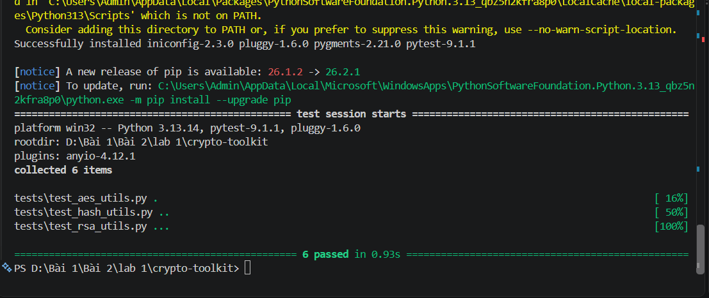

*Hình 1. Kết quả chạy pytest: 6 passed.*

### 3.2. Giao diện dòng lệnh (CLI)

Chức năng mã hóa được thực hiện bằng lệnh:

```powershell
securecrypto-cli --encrypt .\files\data.txt --password pass123
```

Chương trình sinh tệp `files\data.txt.enc` và in ra chuỗi key dạng base64 (Hình 2). Chuỗi này được lưu lại để sử dụng cho bước giải mã.

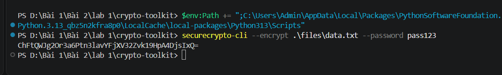

*Hình 2. Mã hóa tệp `data.txt` qua CLI, kết quả trả về key.*

Chiều giải mã được thực hiện với tham số `--password` nhận giá trị là key vừa thu được:

```powershell
securecrypto-cli --decrypt .\files\data.txt.enc --password "<key>"
```

Chương trình thông báo `Decrypted. Output: .\files\data.txt.dec` (Hình 3).

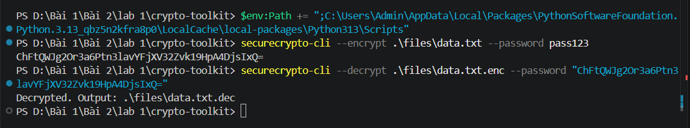

*Hình 3. Giải mã tệp `data.txt.enc` qua CLI.*

Thư mục `files` sau khi thực hiện có ba tệp: bản gốc `data.txt`, bản mã `data.txt.enc` và bản giải mã `data.txt.dec` (Hình 4). Nội dung tệp gốc là chuỗi `HUTECH University`. Việc đối chiếu nội dung tệp giải mã với tệp gốc cho thấy dữ liệu được khôi phục nguyên vẹn.

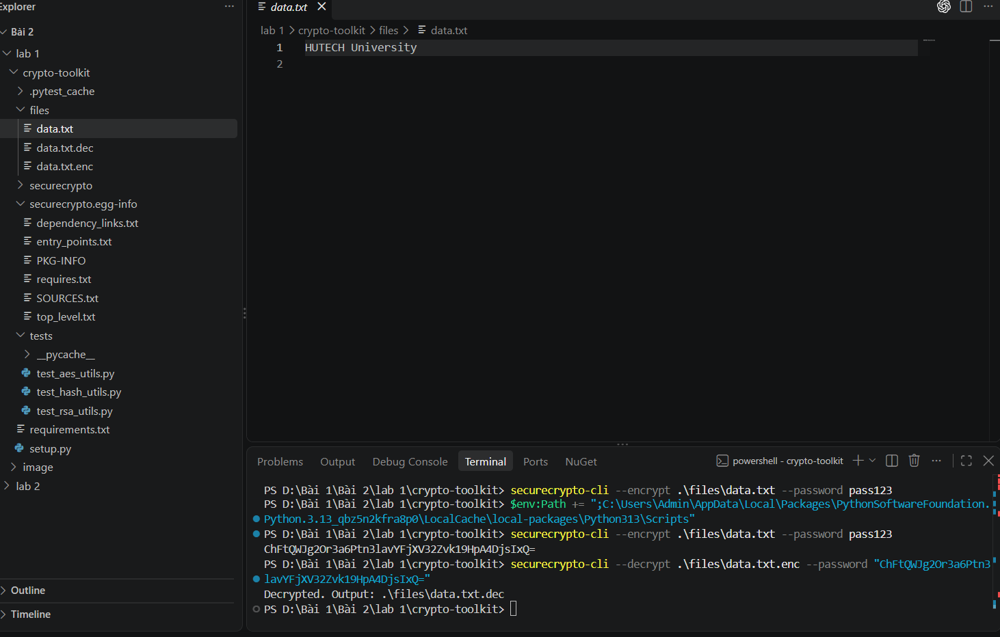

*Hình 4. Cấu trúc thư mục `files` và nội dung tệp `data.txt` sau khi thực hiện mã hóa, giải mã.*

### 3.3. Giao diện đồ họa (GUI)

Giao diện được xây dựng bằng thư viện Tkinter và khởi chạy bằng lệnh `python securecrypto/app_gui.py`. Cửa sổ gồm ô nhập mật khẩu (ẩn ký tự nhập), nút **Encrypt** và nút **Decrypt** (Hình 5).

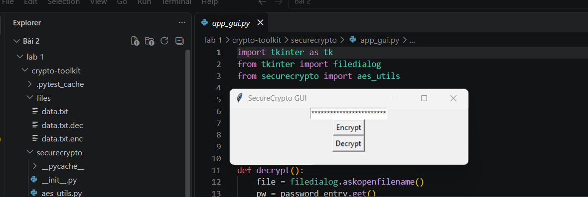

*Hình 5. Giao diện SecureCrypto GUI.*

Khi người dùng nhập mật khẩu, nhấn **Encrypt** và chọn tệp cần mã hóa, giao diện hiển thị key tương ứng ở phía dưới (Hình 6). Key này được nhập vào ô mật khẩu khi thực hiện giải mã.

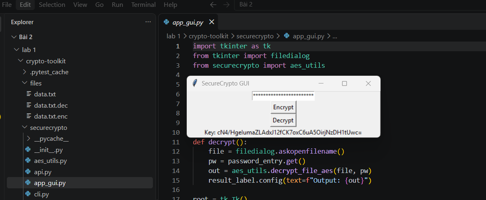

*Hình 6. Mã hóa tệp bằng GUI, key được hiển thị sau khi hoàn tất.*

Ở lần thực hiện thứ hai với một tệp khác trong thư mục `upload`, giao diện cho ra key khác (Hình 7) và sinh thêm tệp `data.txt.dec.enc`. Kết quả này phù hợp với cơ chế sinh `salt` ngẫu nhiên đã nêu ở mục 2.

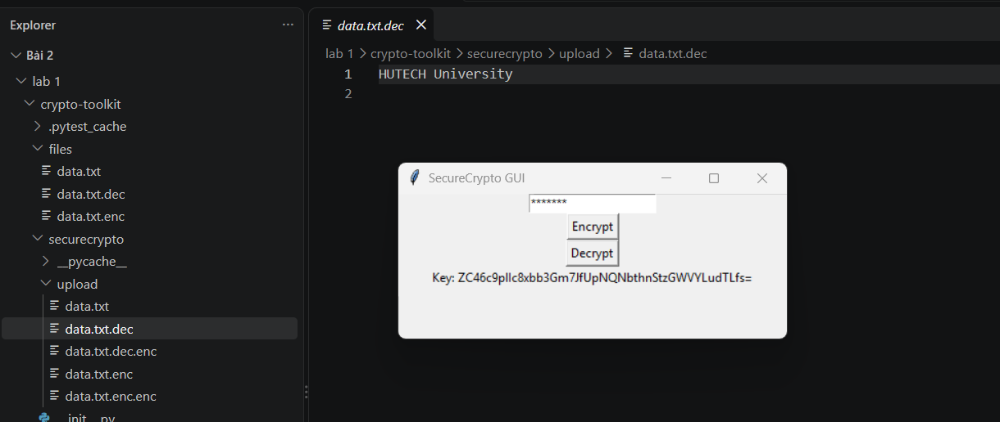

*Hình 7. Mã hóa lần thứ hai bằng GUI, key thay đổi so với lần trước.*

### 3.4. Dịch vụ web (Flask API)

Module `api.py` cung cấp hai điểm cuối `POST /encrypt` và `POST /decrypt`, nhận tệp và tham số `password` dưới dạng `multipart/form-data`. Máy chủ được khởi chạy bằng lệnh `python securecrypto/api.py` và lắng nghe tại địa chỉ `http://127.0.0.1:5000` (Hình 8). Cảnh báo về máy chủ phát triển (development server) hiển thị trong hình là thông báo mặc định của Flask.

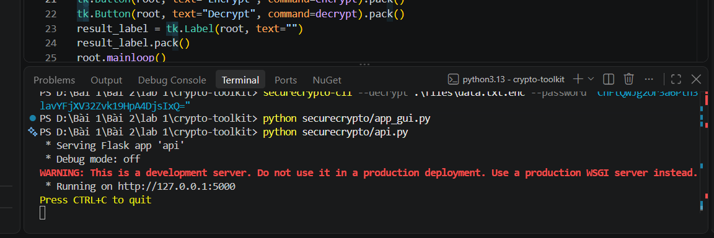

*Hình 8. Máy chủ Flask khởi chạy tại cổng 5000.*

**a) Kiểm thử bằng curl.** Yêu cầu mã hóa được gửi tới `/encrypt`, máy chủ trả về key dưới dạng JSON (Hình 9). Máy chủ lưu tệp tải lên trong thư mục `securecrypto/upload`.

```powershell
curl.exe -F "file=@files/data.txt" -F "password=pass123" http://127.0.0.1:5000/encrypt
```

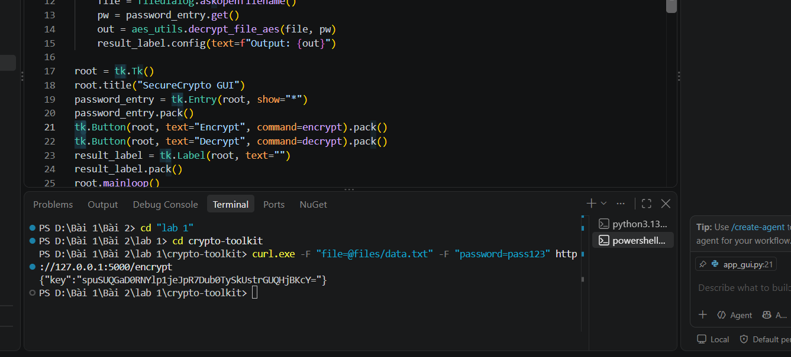

*Hình 9. Gọi API `/encrypt` bằng curl.*

Yêu cầu giải mã gửi tệp `.enc` cùng key tới `/decrypt`, máy chủ trả về đường dẫn tệp đã giải mã (Hình 10). Chuỗi `\u00e0` trong đường dẫn là cách JSON biểu diễn ký tự "à" của thư mục "Bài".

```powershell
curl.exe -F "file=@securecrypto/upload/data.txt.enc" -F "password=<key>" http://127.0.0.1:5000/decrypt
```

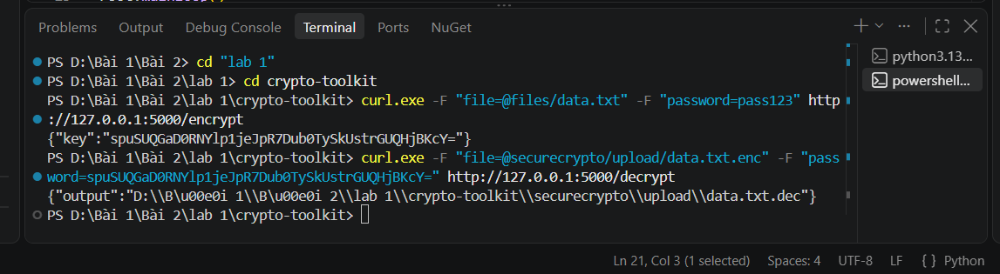

*Hình 10. Gọi API `/decrypt` bằng curl.*

Nội dung tệp `data.txt.dec` thu được là `HUTECH University` (Hình 11), trùng khớp với tệp gốc.

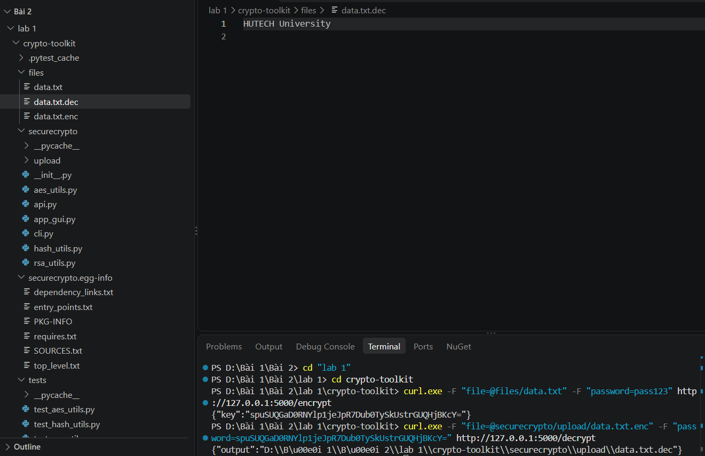

*Hình 11. Nội dung tệp giải mã sau khi gọi API bằng curl.*

**b) Kiểm thử bằng Postman.** Yêu cầu `POST http://127.0.0.1:5000/encrypt` được cấu hình với Body dạng form-data gồm hai trường: `file` (kiểu File) và `password` (kiểu Text). Máy chủ phản hồi mã trạng thái `200 OK` cùng key trong nội dung JSON (Hình 12).

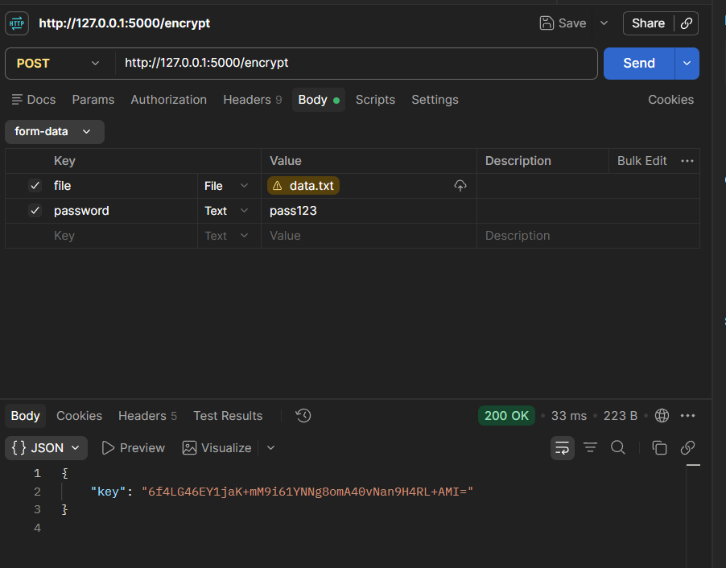

*Hình 12. Kiểm thử API `/encrypt` bằng Postman.*

Với yêu cầu giải mã, trường `file` là tệp `data.txt.enc` và trường `password` là key vừa nhận được. Máy chủ phản hồi `200 OK` và trả về đường dẫn tệp `data.txt.dec` (Hình 13).

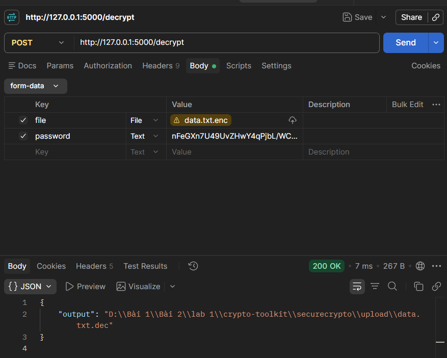

*Hình 13. Kiểm thử API `/decrypt` bằng Postman.*

Nội dung tệp `securecrypto/upload/data.txt.dec` là `HUTECH University`. Nhật ký của máy chủ (Hình 14) ghi nhận một yêu cầu `/decrypt` trả về mã `500` trong lần thử đầu, nguyên nhân là tệp `.enc` được gửi lên không tương ứng với key (máy chủ báo lỗi `InvalidTag` hoặc `Incorrect padding`). Sau khi mã hóa lại và gửi đúng cặp tệp và key, các yêu cầu tiếp theo đều trả về `200`.

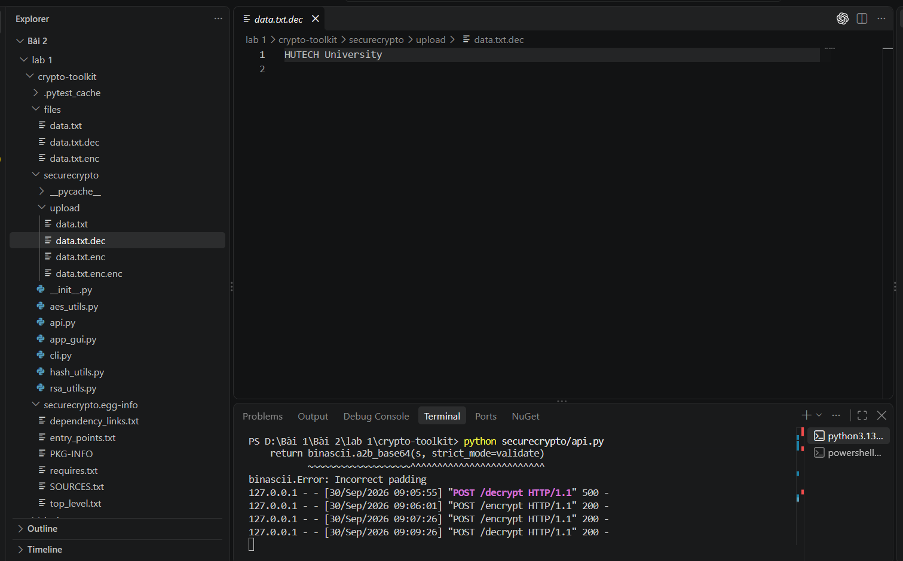

*Hình 14. Nội dung tệp giải mã và nhật ký các yêu cầu tại máy chủ Flask.*

## 4. Nhận xét và kết luận

Thư viện `securecrypto` thực hiện đúng chức năng mã hóa và giải mã tệp tin trên cả ba giao diện CLI, GUI và Web API, nội dung sau khi giải mã trùng khớp với dữ liệu gốc. Một số nhận xét rút ra từ quá trình thực nghiệm:

- Do cơ chế sinh `salt` ngẫu nhiên, key thay đổi ở mỗi lần mã hóa, vì vậy cần lưu key ngay khi mã hóa; mất key đồng nghĩa với không thể giải mã tệp.
- AES-GCM là chế độ mã hóa có xác thực nên việc dùng sai key hoặc tệp bản mã bị thay đổi đều bị phát hiện qua ngoại lệ `InvalidTag`, thay vì trả về dữ liệu sai.
- Hàm giải mã trong thiết kế của bài nhận key thay vì mật khẩu gốc, do đó tham số `password` ở chiều giải mã thực chất mang giá trị key. Đây là điểm cần lưu ý khi sử dụng CLI, GUI và API.
- Máy chủ Flask lưu tệp tải lên với tên gốc trong thư mục `upload`, nên việc gửi tệp có tên trùng sẽ ghi đè tệp cũ. Cần lưu ý điều này khi thử nghiệm nhiều lần liên tiếp.
