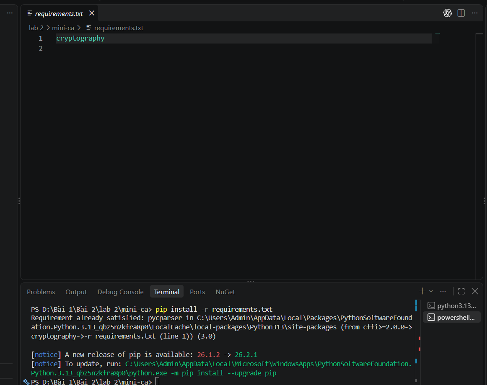
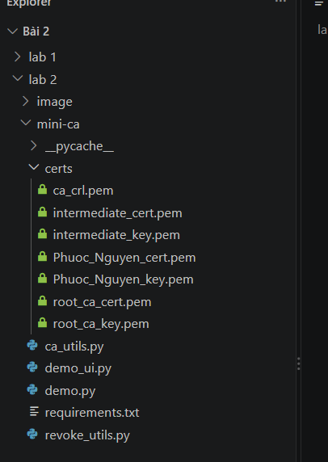
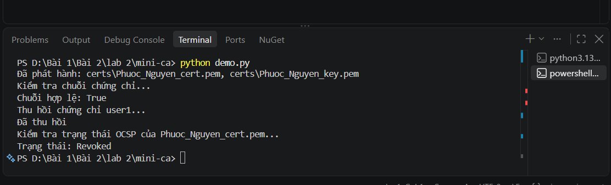
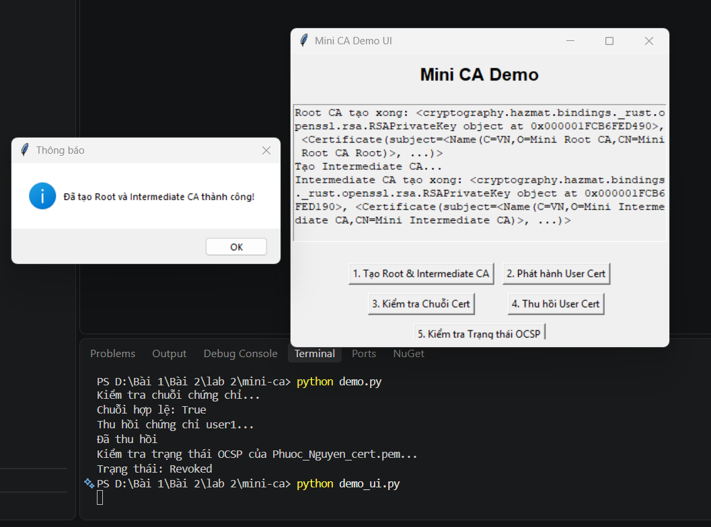

**Họ và tên:** Võ Tự Quang Huy
**MSSV:** 2387700024
**Lớp:** 23DATA1

# LAB 2 _ TUẦN 2

## Xây dựng hệ thống Certificate Authority (Mini CA) trong hạ tầng khóa công khai (PKI)

---

## 1. Cài đặt môi trường và thư viện phụ thuộc

Hệ thống Mini CA được hiện thực bằng ngôn ngữ Python, sử dụng thư viện `cryptography` để xử lý các nghiệp vụ mật mã như sinh cặp khóa bất đối xứng RSA, tạo chứng chỉ X.509, ký số và quản lý danh sách thu hồi chứng chỉ. Danh sách thư viện phụ thuộc được khai báo trong tệp `requirements.txt` và được cài đặt bằng lệnh `pip install -r requirements.txt` tại thư mục `mini-ca`. Việc khai báo phụ thuộc trong một tệp riêng bảo đảm môi trường thực thi có thể tái lập trên nhiều máy khác nhau. Thông báo *Requirement already satisfied* trong hình cho thấy thư viện đã hiện diện trong môi trường Python, do đó dự án đã sẵn sàng để thực thi.

---

## 2. Cấu trúc mã nguồn của dự án

Mã nguồn được tổ chức theo nguyên tắc tách biệt chức năng (separation of concerns):

- `ca_utils.py`: cài đặt các nghiệp vụ lõi của CA, gồm tạo Root CA, tạo Intermediate CA, phát hành chứng chỉ thực thể cuối (end-entity) và xác thực chuỗi chứng chỉ.
- `revoke_utils.py`: cài đặt cơ chế thu hồi chứng chỉ thông qua danh sách thu hồi chứng chỉ (CRL) và tra cứu trạng thái thu hồi.
- `demo.py`: kịch bản minh họa chạy trên giao diện dòng lệnh, thực thi tuần tự toàn bộ vòng đời chứng chỉ.
- `demo_ui.py`: giao diện đồ họa xây dựng bằng `tkinter`, cho phép thao tác từng bước thông qua các nút bấm.

Sau khi chương trình chạy, thư mục `certs/` được tạo tự động nhằm lưu trữ toàn bộ khóa riêng và chứng chỉ ở định dạng PEM, gồm: `root_ca_key.pem`, `root_ca_cert.pem`, `intermediate_key.pem`, `intermediate_cert.pem`, `Phuoc_Nguyen_key.pem`, `Phuoc_Nguyen_cert.pem` và `ca_crl.pem`. Sự xuất hiện đầy đủ các tệp này xác nhận mọi thành phần của hệ thống PKI đã được khởi tạo thành công.

---

## 3. Thực thi kịch bản trên giao diện dòng lệnh (`demo.py`)

Hàm `run_all()` trong `demo.py` thực thi tuần tự năm công đoạn của vòng đời chứng chỉ số, mô phỏng đầy đủ quy trình vận hành của một CA.

**Khởi tạo chuỗi CA.** Hàm `setup_ca()` sinh cặp khóa RSA 2048 bit cho từng CA. Root CA là chứng chỉ tự ký (self-signed), có `issuer` trùng `subject`, thời hạn 10 năm và ràng buộc `path_length=1`, nghĩa là cho phép tối đa một CA trung gian bên dưới. Intermediate CA được Root CA ký, thời hạn 5 năm và ràng buộc `path_length=0`, nghĩa là không được cấp phát thêm CA cấp dưới. Mô hình hai tầng này phản ánh thực tiễn triển khai PKI, trong đó khóa riêng của Root CA được giữ ngoại tuyến và chỉ dùng để ký cho CA trung gian, nhằm giảm thiểu rủi ro lộ khóa gốc.

**Phát hành chứng chỉ người dùng cuối.** Hàm `issue_certificate()` sinh cặp khóa mới cho thực thể `Phuoc_Nguyen`, tạo `subject` từ các thuộc tính quốc gia, tổ chức và tên chung (Common Name), đặt `issuer` là Intermediate CA và ký bằng khóa riêng của CA này. Chứng chỉ có hiệu lực 1 năm và mang phần mở rộng `BasicConstraints` với `ca=False`, nhằm khẳng định chứng chỉ không có thẩm quyền ký chứng chỉ khác. Kết quả in ra dòng "Đã phát hành" cùng đường dẫn hai tệp khóa và chứng chỉ.

**Xác thực chuỗi chứng chỉ.** Hàm `verify_certificate_chain()` lần lượt lấy khóa công khai của từng chứng chỉ phát hành trong chuỗi để kiểm tra chữ ký số của chứng chỉ bên dưới theo lược đồ đệm PKCS#1 v1.5 kết hợp SHA-256. Chứng chỉ người dùng được kiểm tra bằng khóa của Intermediate CA, sau đó chứng chỉ của Intermediate CA được kiểm tra bằng khóa của Root CA. Kết quả `Chuỗi hợp lệ: True` chứng tỏ chuỗi tin cậy được thiết lập liên tục từ chứng chỉ người dùng đến điểm neo tin cậy (trust anchor) là Root CA.

**Thu hồi chứng chỉ.** Hàm `revoke_certificate()` bổ sung số sê-ri của chứng chỉ vào danh sách thu hồi, gắn lý do thu hồi `key_compromise` (khóa riêng bị lộ) và ký lại toàn bộ CRL bằng khóa của CA. Việc ký lại bảo đảm tính toàn vẹn và tính xác thực của danh sách, ngăn chặn việc chỉnh sửa trái phép.

**Kiểm tra trạng thái thu hồi.** Hàm `check_revocation_status()` đối chiếu số sê-ri của chứng chỉ với các mục trong CRL. Kết quả `Trạng thái: Revoked` xác nhận chứng chỉ đã bị vô hiệu hóa, dù thời hạn hiệu lực của nó vẫn còn. Đây là cách mô phỏng đơn giản của giao thức OCSP (Online Certificate Status Protocol).

---

## 4. Thực thi giao diện đồ họa (`demo_ui.py`)

Giao diện đồ họa cung cấp năm nút chức năng tương ứng năm công đoạn ở mục 3, cho phép người dùng điều khiển từng bước và quan sát kết quả trong khung nhật ký (log). Hình trên ghi nhận thao tác **"1. Tạo Root & Intermediate CA"**: hệ thống hiển thị hộp thoại "Đã tạo Root và Intermediate CA thành công!", đồng thời khung nhật ký hiển thị thông tin đối tượng khóa riêng RSA và chứng chỉ với các thuộc tính `C=VN`, `O=Mini Root CA` và `O=Mini Intermediate CA`. Kết quả này khẳng định hai tầng CA đã được khởi tạo đúng thông tin định danh.

Các nút còn lại phải được thao tác theo đúng thứ tự phụ thuộc: phát hành chứng chỉ người dùng (nút 2) đòi hỏi CA đã tồn tại; kiểm tra chuỗi (nút 3) và thu hồi (nút 4) đòi hỏi chứng chỉ người dùng đã được phát hành; kiểm tra trạng thái OCSP (nút 5) đòi hỏi CRL đã được cập nhật sau bước thu hồi.

---

## 5. Quản lý phiên bản và đẩy mã nguồn lên GitHub

Mã nguồn được quản lý bằng Git thông qua ba lệnh: `git add .` để đưa các thay đổi vào vùng chuẩn bị (staging area), `git commit -m "[add] mini-ca"` để ghi nhận một phiên bản mới cùng thông điệp mô tả, và `git push origin main` để đồng bộ nhánh `main` lên kho lưu trữ từ xa. Cách làm này giúp lưu vết lịch sử phát triển và chia sẻ mã nguồn.

Về an toàn thông tin, thư mục `certs/` và các tệp `*.pem` được khai báo trong `.gitignore` để **không** đưa lên kho lưu trữ. Lý do là các tệp này chứa khóa riêng không mã hóa (`NoEncryption`); nếu bị công khai, kẻ tấn công có thể mạo danh CA và phát hành chứng chỉ giả mạo, làm mất toàn bộ giá trị của hệ thống PKI.

---

## 6. Kết luận

Lab đã hiện thực thành công một hệ thống CA thu nhỏ với đầy đủ vòng đời chứng chỉ số: khởi tạo chuỗi tin cậy Root CA → Intermediate CA, phát hành chứng chỉ thực thể cuối, xác thực chuỗi chứng chỉ, thu hồi chứng chỉ và kiểm tra trạng thái thu hồi. Qua đó, người thực hiện nắm được vai trò của chữ ký số trong việc thiết lập niềm tin giữa các bên, ý nghĩa của các ràng buộc `BasicConstraints` và `path_length`, cũng như sự cần thiết của cơ chế thu hồi khi khóa riêng bị xâm phạm.

Lưu ý về giới hạn của mô hình: khóa riêng được lưu không mã hóa, CRL chỉ là tệp cục bộ và việc kiểm tra "OCSP" thực chất là tra cứu CRL, nên hệ thống chỉ phục vụ mục đích học tập, không dùng cho môi trường thực tế.
