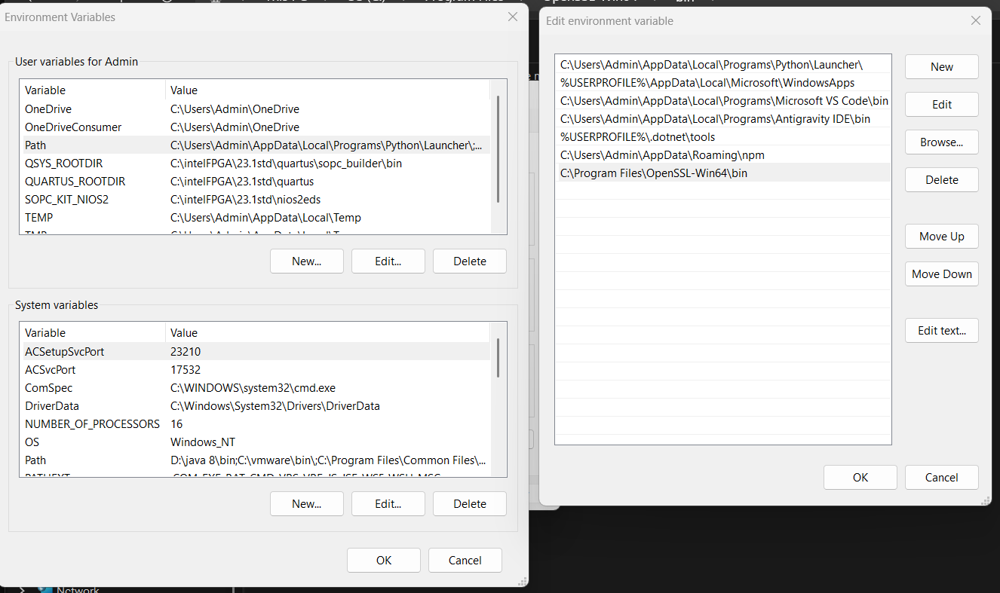
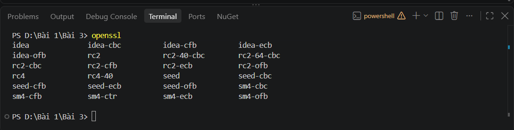
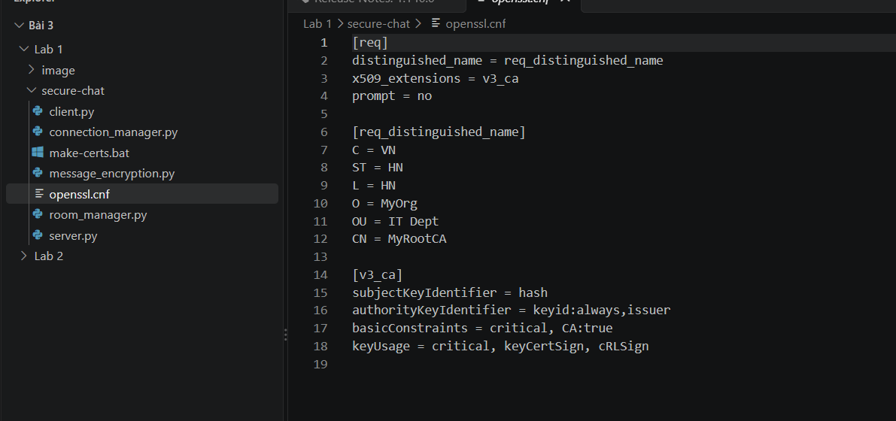
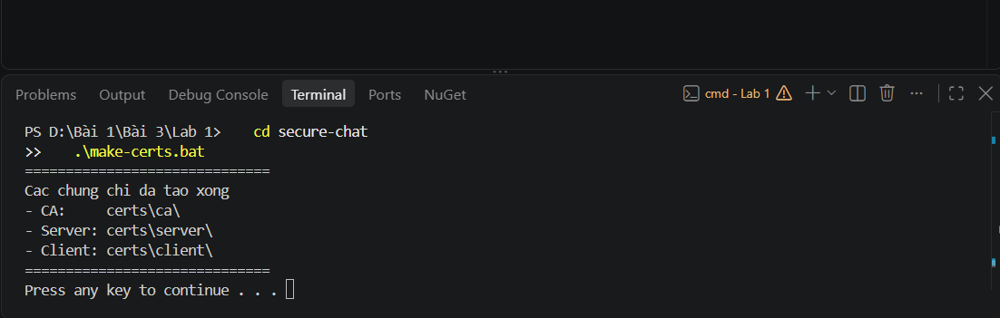
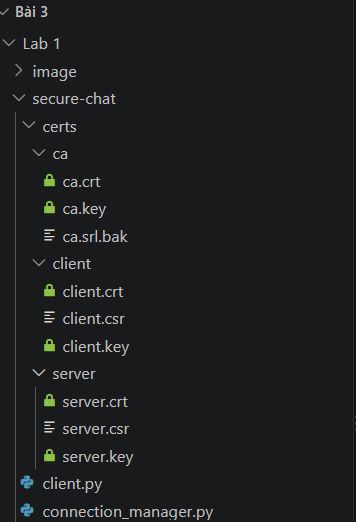
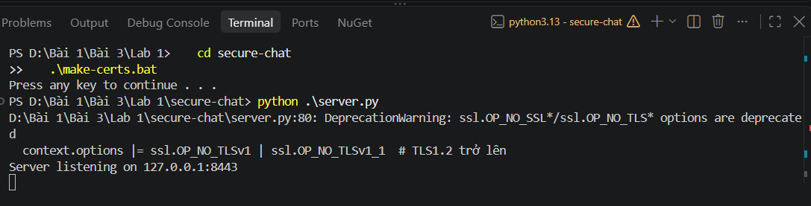
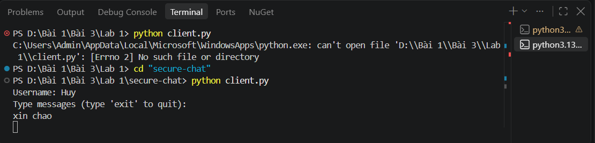
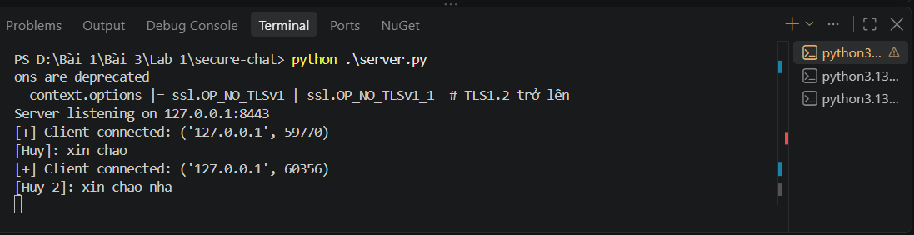

**Họ và tên:** Võ Tự Quang Huy
**MSSV:** 2387700024
**Lớp:** 23DATA1

# LAB 1 _ TUẦN 3

## Xây dựng ứng dụng Secure Chat: TLS xác thực hai chiều (mTLS) kết hợp mã hóa AES-256

| Mục | Nội dung |
|---|---|
| Chủ đề | Secure Chat sử dụng chứng chỉ X.509 do CA tự tạo, TLS ≥ 1.2 và AES-256-CBC |
| Môi trường | Windows, VS Code (PowerShell), Python 3.13, OpenSSL Win64 |

---

## 1. Mục tiêu

1. Cài đặt và cấu hình OpenSSL trên Windows, đưa vào biến môi trường `PATH`.
2. Xây dựng một **hạ tầng khóa công khai (PKI) thu nhỏ** gồm: CA gốc, chứng chỉ server, chứng chỉ client.
3. Xây dựng ứng dụng chat đa client có **hai lớp bảo vệ**:
   - **Lớp vận chuyển:** TLS với xác thực hai chiều (server và client xác thực lẫn nhau bằng chứng chỉ).
   - **Lớp ứng dụng:** mã hóa nội dung tin nhắn bằng AES-256-CBC.
4. Kiểm thử hoạt động với nhiều client kết nối đồng thời.

## 2. Cơ sở lý thuyết tóm tắt

**Chứng chỉ X.509 và CA.** Chứng chỉ gắn một khóa công khai với một danh tính (Subject) và được ký số bởi một Certification Authority (CA). Bên nhận tin tưởng CA thì tin tưởng mọi chứng chỉ do CA đó ký. Trong lab, CA là tự ký (self-signed root CA) và đóng vai trò gốc tin cậy duy nhất.

**TLS xác thực hai chiều (mutual TLS – mTLS).** TLS thông thường chỉ client xác thực server. Với mTLS, server cũng **bắt buộc** client xuất trình chứng chỉ hợp lệ (`CERT_REQUIRED`), nên kẻ không có chứng chỉ do CA ký sẽ không thể hoàn tất bắt tay (handshake).

**AES-256-CBC.** Mã khối đối xứng với khóa 256 bit, chế độ CBC dùng vector khởi tạo (IV) ngẫu nhiên 16 byte cho mỗi tin nhắn, kết hợp đệm PKCS7 để đủ bội số 16 byte. Bản mã gửi đi có dạng `IV || ciphertext`.

**Kiến trúc chung của ứng dụng:**

```
Client ──(TLS 1.2+, mTLS)──► Server
  │  1. Bắt tay TLS, hai bên kiểm tra chứng chỉ bằng ca.crt
  │  2. Client gửi "username:khóa_AES_hex" (đi trong kênh TLS đã mã hóa)
  │  3. Client mã hóa tin bằng AES-256-CBC rồi gửi
  │  4. Server giải mã bằng khóa của người gửi, mã hóa lại bằng khóa
  ▼     của từng client khác rồi chuyển tiếp
Mỗi client xử lý bởi một luồng (thread) riêng
```

---

## 3. Báo cáo chi tiết từng hình

### Hình 1 – Thêm OpenSSL vào biến môi trường PATH



**Nội dung hình.** Cửa sổ *Environment Variables* của Windows. Hộp thoại *Edit environment variable* hiển thị danh sách giá trị của biến `Path` (mục *User variables*), trong đó dòng cuối cùng là `C:\Program Files\OpenSSL-Win64\bin` vừa được thêm vào.

**Mục đích.** Khi gõ lệnh `openssl` trong terminal, hệ điều hành tìm tệp `openssl.exe` lần lượt trong các thư mục liệt kê ở `Path`. Thêm thư mục `bin` của OpenSSL giúp gọi lệnh từ bất kỳ thư mục làm việc nào mà không cần gõ đường dẫn đầy đủ. Điều này bắt buộc vì script `make-certs.bat` gọi `openssl` trực tiếp.

**Nhận xét.** Đường dẫn được thêm vào *User variables* nên chỉ có hiệu lực với tài khoản hiện tại, và phải mở lại terminal/VS Code thì tiến trình mới nhận biến mới.

---

### Hình 2 – Kiểm tra OpenSSL đã cài đặt thành công



**Nội dung hình.** Terminal PowerShell trong VS Code, thư mục `D:\Bài 1\Bài 3`, chạy lệnh `openssl` không tham số. Hệ thống in ra danh sách lệnh hỗ trợ; phần nhìn thấy là cuối mục *Cipher commands* (`idea`, `rc2`, `rc4`, `seed`, `sm4`…).

**Mục đích.** Xác nhận hai điều: (1) OpenSSL đã được cài đặt; (2) `PATH` cấu hình đúng, vì shell tìm và chạy được `openssl.exe`.

**Nhận xét.** Việc `openssl` chạy được và liệt kê các lệnh cho thấy môi trường sẵn sàng cho bước sinh khóa và chứng chỉ. Các thuật toán cũ trong danh sách (`rc2`, `rc4`, `idea`) chỉ để tham khảo, không được dùng trong lab; ứng dụng dùng AES thông qua thư viện `cryptography` của Python.

---

### Hình 3 – Tệp cấu hình `openssl.cnf`



**Nội dung hình.** Tệp `Lab 1/secure-chat/openssl.cnf` mở trong VS Code, cùng cây thư mục bên trái gồm `client.py`, `connection_manager.py`, `make-certs.bat`, `message_encryption.py`, `openssl.cnf`, `room_manager.py`, `server.py`.

**Mục đích.** Tệp này mô tả thông tin danh tính và các phần mở rộng (extension) của **chứng chỉ CA gốc**, được lệnh `openssl req -x509 ... -config openssl.cnf -extensions v3_ca` sử dụng.

**Giải thích các thành phần:**

| Khai báo | Ý nghĩa |
|---|---|
| `prompt = no` | Không hỏi tương tác, lấy thông tin trực tiếp từ tệp cấu hình. |
| `[req_distinguished_name]` | Tên phân biệt (DN) của CA: `C=VN` (quốc gia), `ST=HN`, `L=HN`, `O=MyOrg` (tổ chức), `OU=IT Dept`, `CN=MyRootCA`. |
| `subjectKeyIdentifier = hash` | Định danh khóa công khai của chủ thể, tạo bằng băm. |
| `authorityKeyIdentifier = keyid:always,issuer` | Định danh khóa của bên cấp phát; với CA gốc tự ký, bên cấp phát chính là nó. |
| `basicConstraints = critical, CA:true` | Khẳng định đây là chứng chỉ CA (được phép ký chứng chỉ khác). Thuộc tính `critical` buộc phần mềm phải hiểu và tuân thủ ràng buộc này. |
| `keyUsage = critical, keyCertSign, cRLSign` | Giới hạn mục đích khóa: chỉ ký chứng chỉ và ký danh sách thu hồi (CRL). |

**Nhận xét.** Cấu hình đúng nguyên tắc đặc quyền tối thiểu: khóa của CA chỉ được dùng cho việc cấp và thu hồi chứng chỉ, không dùng để mã hóa dữ liệu.

---

### Hình 4 – Chạy `make-certs.bat` để sinh khóa và chứng chỉ



**Nội dung hình.** Terminal chuyển vào thư mục `secure-chat` bằng `cd secure-chat`, chạy `.\make-certs.bat`. Kết quả báo hoàn tất: *"Cac chung chi da tao xong"*, liệt kê ba thư mục `certs\ca\`, `certs\server\`, `certs\client\`, kết thúc bằng *"Press any key to continue"*.

**Mục đích.** Tự động hóa toàn bộ quy trình PKI:

1. Tạo ba thư mục `certs\ca`, `certs\server`, `certs\client`.
2. **CA:** `openssl genrsa` sinh khóa RSA 2048 bit, sau đó `openssl req -x509 -new -nodes ... -sha256 -days 3650` tạo chứng chỉ gốc tự ký có hiệu lực 10 năm.
3. **Server:** sinh khóa RSA, tạo yêu cầu cấp chứng chỉ (CSR) với `CN=localhost`, rồi `openssl x509 -req ... -CA ... -CAkey ...` để CA ký, tạo `server.crt`.
4. **Client:** làm tương tự với `CN=client`, tạo `client.crt`.
5. Đổi tên `ca.srl` thành `ca.srl.bak` để tránh xung đột số serial khi chạy lại.

**Nhận xét.** Hai chứng chỉ server và client đều do **cùng một CA** ký nên hai bên có thể kiểm tra lẫn nhau chỉ với `ca.crt`. Tham số `-nodes` để khóa riêng không đặt mật khẩu bảo vệ, thuận tiện cho thực hành nhưng không phù hợp môi trường thực tế.

---

### Hình 5 – Cấu trúc thư mục `certs` sau khi sinh chứng chỉ



**Nội dung hình.** Trình duyệt tệp (Explorer) của VS Code, thư mục `secure-chat/certs` gồm ba nhánh:

| Thư mục | Tệp | Vai trò |
|---|---|---|
| `ca` | `ca.crt`, `ca.key`, `ca.srl.bak` | Chứng chỉ gốc, khóa riêng của CA, tệp số serial đã đổi tên. |
| `client` | `client.crt`, `client.csr`, `client.key` | Chứng chỉ, yêu cầu ký và khóa riêng của client. |
| `server` | `server.crt`, `server.csr`, `server.key` | Chứng chỉ, yêu cầu ký và khóa riêng của server. |

**Mục đích.** Kiểm chứng đầu ra của Hình 4: đã có đủ ba bộ khóa/chứng chỉ cần cho mTLS.

**Nhận xét.** Mỗi bên sở hữu cặp (`.key` bí mật, `.crt` công khai). Tệp `.csr` chỉ là trung gian trong quá trình xin ký. **Các tệp `.key` là bí mật**, tuyệt đối không đưa lên kho mã nguồn công khai; vì vậy thư mục `certs/` nên được khai báo trong `.gitignore`.

---

### Hình 6 – Khởi động server



**Nội dung hình.** Terminal (Python 3.13) tại `...\Lab 1\secure-chat>`, chạy `python .\server.py`. Server in cảnh báo `DeprecationWarning` tại dòng 80 rồi thông báo `Server listening on 127.0.0.1:8443`.

**Mục đích.** Khởi chạy máy chủ chat. Khi chạy, server thực hiện các bước:

1. Tạo ngữ cảnh TLS phía máy chủ (`ssl.Purpose.CLIENT_AUTH`).
2. Nạp chứng chỉ và khóa riêng của server (`load_cert_chain`).
3. Nạp `ca.crt` để kiểm tra chứng chỉ của client (`load_verify_locations`).
4. Đặt `verify_mode = ssl.CERT_REQUIRED`: **bắt buộc** client có chứng chỉ hợp lệ.
5. Cấm TLS 1.0 và 1.1 (`OP_NO_TLSv1 | OP_NO_TLSv1_1`), chỉ chấp nhận TLS 1.2 trở lên.
6. Lắng nghe tại cổng 8443 trên địa chỉ loopback `127.0.0.1` (chỉ máy cục bộ truy cập được).

**Về cảnh báo `DeprecationWarning`.** Các cờ `OP_NO_TLSv1`, `OP_NO_TLSv1_1` đã bị đánh dấu lỗi thời trong Python hiện đại. Cảnh báo **không ảnh hưởng chức năng**. Cách viết được khuyến nghị là `context.minimum_version = ssl.TLSVersion.TLSv1_2`.

**Nhận xét.** Server khởi động thành công, nghĩa là các tệp `server.crt`, `server.key`, `ca.crt` hợp lệ và tương thích với nhau, vì nếu sai, bước nạp chứng chỉ sẽ ném ngoại lệ ngay.

---

### Hình 7 – Khởi động client và gửi tin nhắn



**Nội dung hình.** Hai giai đoạn trong terminal:

1. Chạy `python client.py` ở thư mục `Lab 1` thì **thất bại** với `[Errno 2] No such file or directory`, vì tệp `client.py` không nằm ở thư mục đó.
2. Sau khi `cd "secure-chat"` và chạy lại, client hỏi `Username:`, nhập `Huy`, hiện dòng `Type messages (type 'exit' to quit):` và tin nhắn `xin chao` được gửi đi.

**Mục đích và giải thích.** Khi khởi động, client thực hiện:

1. Sinh khóa phiên AES-256 ngẫu nhiên (`os.urandom(32)`).
2. Tạo ngữ cảnh TLS phía client, nạp `ca.crt` để kiểm tra server, nạp `client.crt`/`client.key` để **xuất trình danh tính** cho server.
3. Kết nối TCP tới `127.0.0.1:8443` và bắt tay TLS.
4. Gửi chuỗi `username:khóa_AES_dạng_hex` qua kênh TLS, nên khóa AES không lộ trên đường truyền.
5. Mở một luồng nền nhận tin; luồng chính đọc bàn phím, mã hóa từng tin bằng AES-256-CBC trước khi gửi.

**Về lỗi ở giai đoạn 1.** Các đường dẫn `certs/...` trong mã là **đường dẫn tương đối**, được hiểu theo thư mục làm việc hiện tại. Vì vậy phải đứng trong `secure-chat` khi chạy `server.py` và `client.py`. Lỗi này là lỗi thao tác, không phải lỗi mã nguồn, và đã được khắc phục.

**Nhận xét.** Client kết nối thành công và cho phép nhập tin nhắn, chứng tỏ bắt tay mTLS đã hoàn tất: server chấp nhận chứng chỉ client và client chấp nhận chứng chỉ server.

---

### Hình 8 – Server nhận tin nhắn từ hai client đồng thời



**Nội dung hình.** Nhật ký của server cho thấy:

```
Server listening on 127.0.0.1:8443
[+] Client connected: ('127.0.0.1', 59770)
[Huy]: xin chao
[+] Client connected: ('127.0.0.1', 60356)
[Huy 2]: xin chao nha
```

Danh sách bên phải cho thấy có nhiều terminal Python đang chạy cùng lúc.

**Mục đích.** Kiểm thử khả năng phục vụ **nhiều client đồng thời** và xác minh toàn bộ chuỗi bảo mật từ đầu đến cuối.

**Phân tích:**

- Hai dòng `Client connected` có **cổng nguồn khác nhau** (59770 và 60356) là hai kết nối TCP/TLS độc lập; mỗi kết nối được giao cho một luồng riêng (`threading.Thread`), nên server không bị chặn bởi client trước.
- Các dòng `[Huy]: xin chao` và `[Huy 2]: xin chao nha` là **bản rõ sau khi giải mã**. Server chỉ in được đúng nội dung khi: (1) bắt tay TLS với chứng chỉ client thành công; (2) nhận đúng khóa AES do client gửi; (3) giải mã AES-256-CBC và bỏ đệm PKCS7 thành công.
- Mỗi client có khóa AES riêng, do server lưu trong `ConnectionManager` theo từng socket.

**Nhận xét.** Kết quả khẳng định hệ thống hoạt động đúng thiết kế: xác thực hai chiều, mã hóa tin nhắn, và xử lý đa luồng.

---

## 4. Tổng hợp minh chứng

| Hình | Nội dung | Kết quả đạt được |
|---|---|---|
| 1 | Cấu hình `PATH` | OpenSSL gọi được từ mọi thư mục |
| 2 | Chạy `openssl` | Cài đặt và `PATH` đúng |
| 3 | `openssl.cnf` | Cấu hình đúng chuẩn cho CA gốc |
| 4 | Chạy `make-certs.bat` | Sinh CA, server, client thành công |
| 5 | Cây thư mục `certs` | Đủ 9 tệp khóa/chứng chỉ/CSR + tệp serial |
| 6 | Chạy `server.py` | Server TLS ≥ 1.2, bắt buộc chứng chỉ client |
| 7 | Chạy `client.py` | Bắt tay mTLS thành công, gửi được tin |
| 8 | Nhật ký server | Phục vụ 2 client đồng thời, giải mã đúng |

## 5. Đánh giá bảo mật và hạn chế

| Vấn đề | Phân tích | Hướng cải thiện |
|---|---|---|
| Toàn vẹn tin nhắn | AES-CBC chỉ bảo mật, **không xác thực** nội dung; kẻ tấn công có thể chỉnh sửa bản mã. Tuy nhiên tin đi trong kênh TLS (vốn đã có xác thực) nên rủi ro được giảm. | Dùng AES-GCM hoặc thêm HMAC. |
| Không mã hóa đầu cuối | Server giải mã rồi mã hóa lại cho từng người nhận nên **server thấy được bản rõ**. | Mã hóa đầu cuối giữa các client. |
| `check_hostname = False` | Client không đối chiếu `CN`/SAN với tên máy chủ; chứng chỉ server cũng chưa có trường SAN. Chấp nhận được trong lab vì dùng CA riêng. | Thêm SAN cho chứng chỉ server và bật `check_hostname`. |
| Bảo vệ khóa riêng | `-nodes` để khóa không có mật khẩu. | Mã hóa khóa bằng passphrase; không commit thư mục `certs/`. |
| Phân tách thông điệp | TCP là dòng byte, `recv(4096)` có thể gộp hoặc cắt tin. | Thêm tiền tố độ dài cho mỗi tin. |
| Quản lý phòng | Mới chỉ dùng phòng mặc định `general`. | Bổ sung lệnh tạo, vào, rời phòng. |

## 6. Kết luận

Lab đã xây dựng thành công ứng dụng chat bảo mật với hai lớp bảo vệ:

1. **Hạ tầng PKI** tự quản gồm CA gốc, chứng chỉ server và chứng chỉ client, sinh tự động bằng OpenSSL (Hình 1–5).
2. **Kênh truyền TLS xác thực hai chiều** (Hình 6–8): server chỉ chấp nhận client có chứng chỉ do CA ký, và client cũng xác minh server.
3. **Mã hóa tin nhắn AES-256-CBC** với IV ngẫu nhiên, khóa phiên riêng cho từng client, trao đổi qua kênh TLS (Hình 7–8).
4. **Xử lý đa luồng:** nhiều client kết nối đồng thời mà không ảnh hưởng nhau (Hình 8).

Bài lab giúp thực hiện nắm được quy trình cấp phát chứng chỉ, sự khác nhau giữa TLS một chiều và hai chiều, cách kết hợp bảo mật tầng vận chuyển với mã hóa tầng ứng dụng, cũng như các hạn chế cần cải thiện nếu đưa vào môi trường thực tế (mục 5).

---

## 7. Cấu trúc thư mục 

```
secure-chat/
├── certs/                  # sinh bởi make-certs.bat (không commit)
│   ├── ca/      ca.crt, ca.key, ca.srl.bak
│   ├── server/  server.crt, server.csr, server.key
│   └── client/  client.crt, client.csr, client.key
├── openssl.cnf
├── make-certs.bat
├── message_encryption.py
├── connection_manager.py
├── room_manager.py
├── server.py
└── client.py
```
