**Họ và tên:** Võ Tự Quang Huy  
**MSSV:** 2387700024  
**Lớp:** 23DATA1

# LAB 2 _ TUẦN 3

## NetRecon – Bộ công cụ khám phá mạng (Network Reconnaissance Toolkit)

| Mục | Nội dung |
|---|---|
| Môn học | Bảo mật mạng máy tính – Bài 3 |
| Nội dung | Quét cổng, nhận diện dịch vụ, lấy banner, lập sơ đồ mạng, kiểm tra lỗ hổng, gửi báo cáo qua email |
| Công nghệ | Python 3.13, Flask, Click, asyncio, Nmap 7.991, SMTP (Gmail) |
| Giao diện | Dòng lệnh (`cli.py`) và web (`app.py`) |

> **Lưu ý đạo đức và pháp lý:** Quét cổng chỉ được thực hiện trên máy của chính mình hoặc hệ thống được cho phép. Trong báo cáo này, đối tượng quét gồm máy cục bộ (`10.12.23.82`, `192.168.1.1`) và `scanme.nmap.org`, là máy chủ do dự án Nmap công khai cho phép thử nghiệm.

---

## 1. Mục tiêu

1. Cài đặt Nmap và chuẩn bị môi trường Python cho công cụ.
2. Xây dựng bộ công cụ **NetRecon** gồm 5 chức năng:
   - **PortScanner:** quét cổng TCP bất đồng bộ (asyncio) có giới hạn tốc độ.
   - **ServiceDetector:** nhận diện dịch vụ và phiên bản bằng `nmap -sV`.
   - **BannerGrabber:** lấy banner dịch vụ qua socket.
   - **NetworkMapper:** khám phá sơ đồ mạng cục bộ bằng bảng ARP.
   - **VulnChecker:** gợi ý lỗ hổng (CVE) theo cổng.
3. Cung cấp hai giao diện sử dụng (CLI và web) và tự động gửi kết quả qua email.
4. Đáp ứng các yêu cầu vận hành: **giới hạn tốc độ** (`Semaphore`), **ghi log** có thời gian (`netrecon.log`), bảo vệ thông tin nhạy cảm (`.env`, `.gitignore`).

## 2. Cơ sở lý thuyết tóm tắt

| Chức năng | Kỹ thuật | Nguyên lý |
|---|---|---|
| Quét cổng | TCP connect scan | Thử hoàn tất bắt tay TCP 3 bước tới từng cổng; kết nối thành công nghĩa là cổng **open**. Dùng `asyncio.open_connection` với `Semaphore` (mặc định 100) để chạy song song nhưng không quá tải, và `wait_for(timeout=1)` để bỏ qua cổng không phản hồi. |
| Nhận diện dịch vụ | `nmap -sV -p <cổng> <ip>` | Nmap gửi các thăm dò (probe) và đối chiếu phản hồi với cơ sở dữ liệu dấu vân tay để xác định dịch vụ và phiên bản. |
| Banner grabbing | Socket TCP, timeout 2 giây | Kết nối rồi đọc dữ liệu dịch vụ tự gửi ngay khi kết nối (ví dụ SSH gửi chuỗi phiên bản). |
| Sơ đồ mạng | `arp -a` | Bảng ARP liệt kê các địa chỉ IP và MAC mà máy đã giao tiếp gần đây, theo từng card mạng (Interface). |
| Kiểm tra lỗ hổng | Tra cứu tĩnh | Từ điển cố định ánh xạ cổng sang các CVE phổ biến của dịch vụ thường chạy trên cổng đó. |
| Gửi email | SMTP + STARTTLS | Kết nối cổng 587 dạng thường rồi nâng cấp lên mã hóa bằng `STARTTLS`; đăng nhập bằng **mật khẩu ứng dụng** của Google. |

**Kiến trúc:**

```
        ┌────────── cli.py (Click) ──────────┐
Người   │                                     │      ┌─ port_scanner.py     (asyncio)
dùng ───┤                                     ├─────►├─ service_detector.py (nmap -sV)
        │                                     │      ├─ banner_grabber.py   (socket)
        └────────── app.py (Flask) ───────────┘      ├─ network_mapper.py   (arp -a)
              │  templates/ + static/                 ├─ vuln_checker.py     (tra cứu CVE)
              └──► email_sender.py (SMTP) ──► Gmail   └─ netrecon.log        (nhật ký)
```

---

## 3. Báo cáo chi tiết từng hình

### Hình 1 – Kiểm tra Nmap đã cài đặt

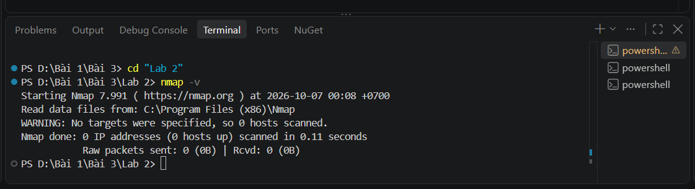

**Nội dung hình.** Terminal VS Code tại `D:\Bài 1\Bài 3\Lab 2>`, chạy `nmap -v`. Kết quả: `Starting Nmap 7.991`, `Read data files from: C:\Program Files (x86)\Nmap`, cảnh báo `No targets were specified, so 0 hosts scanned` và `Nmap done: 0 IP addresses`.

**Mục đích.** Xác nhận Nmap đã được cài đặt và gọi được từ terminal (nằm trong `PATH`). Module `service_detector.py` gọi `nmap` thông qua `subprocess`, nên nếu thiếu bước này chức năng nhận diện dịch vụ sẽ lỗi.

**Nhận xét.** Chạy `nmap` mà không chỉ định mục tiêu là cách kiểm tra an toàn: Nmap khởi động, nạp dữ liệu từ thư mục cài đặt, rồi báo không có máy đích nào để quét. Điều này chứng tỏ chương trình và các tệp dữ liệu hoạt động bình thường.

---

### Hình 2 – Tạo mật khẩu ứng dụng (App Password) của Google

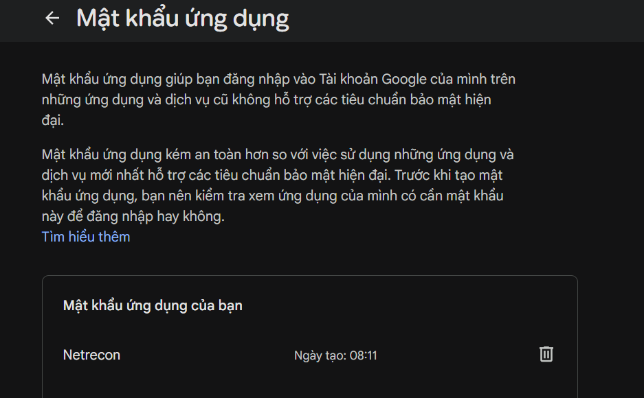

**Nội dung hình.** Trang *Mật khẩu ứng dụng* của tài khoản Google, mục *Mật khẩu ứng dụng của bạn* có một mục tên **Netrecon**, ngày tạo 08:11.

**Mục đích.** Gmail không cho ứng dụng bên thứ ba đăng nhập SMTP bằng mật khẩu tài khoản. Thay vào đó cần một **mật khẩu ứng dụng** riêng 16 ký tự, được cấp cho từng ứng dụng và chỉ khả dụng khi tài khoản đã bật xác minh hai bước.

**Nhận xét.** Dùng mật khẩu ứng dụng có ba lợi ích: (1) mật khẩu thật của tài khoản không bị lưu trong mã nguồn hay tệp cấu hình; (2) có thể **thu hồi riêng** từng ứng dụng bằng biểu tượng thùng rác mà không ảnh hưởng tài khoản; (3) phạm vi rủi ro nhỏ hơn khi bị lộ. Ảnh chỉ hiển thị tên và thời điểm tạo, không để lộ giá trị mật khẩu.

---

### Hình 3 – Tệp `requirements.txt`

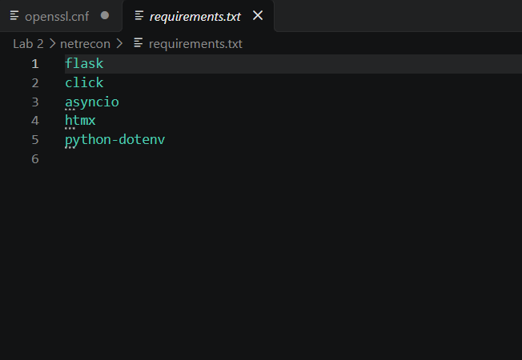

**Nội dung hình.** Tệp `Lab 2/netrecon/requirements.txt` gồm 5 thư viện: `flask`, `click`, `asyncio`, `htmx`, `python-dotenv`.

**Mục đích.** Khai báo tập thư viện cần cài để dự án chạy được, giúp môi trường dễ tái tạo trên máy khác.

| Thư viện | Vai trò trong NetRecon |
|---|---|
| `flask` | Khung web cho giao diện `app.py`, xử lý các route `/` và `/scan`, nạp mẫu Jinja2. |
| `click` | Xây dựng giao diện dòng lệnh `cli.py` với các tùy chọn `--target`, `--ports`, `--rate-limit`, `--mode`. |
| `asyncio` | Lập trình bất đồng bộ cho bộ quét cổng. Thư viện này đã tích hợp sẵn trong Python, nên khai báo ở đây chỉ mang tính liệt kê. |
| `htmx` | Dùng trong mẫu `index.html` (thuộc tính `hx-post`, `hx-target`) để gửi biểu mẫu mà không tải lại trang. |
| `python-dotenv` | Đọc biến môi trường từ tệp `.env` (`load_dotenv()`), tách thông tin nhạy cảm khỏi mã nguồn. |

---

### Hình 4 – Tệp `.env` chứa thông tin đăng nhập SMTP

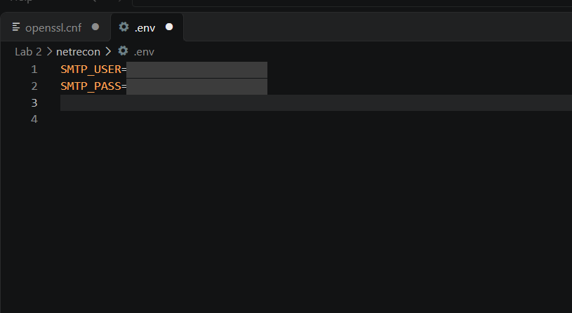

**Nội dung hình.** Tệp `Lab 2/netrecon/.env` gồm hai biến: `SMTP_USER` (tài khoản Gmail gửi thư) và `SMTP_PASS` (mật khẩu ứng dụng ở Hình 2). Phần giá trị đã được che trong báo cáo.

**Mục đích.** Lưu thông tin xác thực **ngoài mã nguồn**. Trong `app.py`, các giá trị được lấy bằng `os.getenv("SMTP_USER")` và `os.getenv("SMTP_PASS")` rồi truyền cho `send_email()`.

**Nhận xét.** Tách cấu hình khỏi mã là nguyên tắc cơ bản của phát triển an toàn (quy tắc *twelve-factor app*). Vì tệp chứa bí mật nên phải bảo đảm nó **không bị đưa lên kho Git**, thực hiện ở Hình 6. Lưu ý vận hành: Flask chỉ nạp `.env` khi khởi động, nên sau khi sửa tệp phải chạy lại `app.py`, và phải **lưu tệp** trước khi chạy (tab hiển thị chấm tròn nghĩa là chưa lưu).

---

### Hình 5 – Cài đặt thư viện bằng `pip`

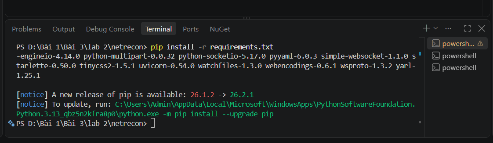

**Nội dung hình.** Terminal tại `D:\Bài 1\Bài 3\lab 2\netrecon>`, chạy `pip install -r requirements.txt`. Phần cuối kết quả liệt kê các gói được cài kèm (như `starlette`, `uvicorn`, `python-socketio`, `pyyaml`, `watchfiles`, `yarl`...) và thông báo có phiên bản pip mới.

**Mục đích.** Cài toàn bộ thư viện ở Hình 3 cùng các **gói phụ thuộc** của chúng vào môi trường Python 3.13.

**Nhận xét.** Lệnh chạy hoàn tất không có lỗi nên môi trường đã sẵn sàng. Thông báo `[notice] A new release of pip is available` chỉ là gợi ý nâng cấp, không ảnh hưởng chức năng. Việc nhiều gói phụ thuộc được kéo theo cho thấy một dòng khai báo có thể kéo vào nhiều thư viện, đây là vấn đề **chuỗi cung ứng phần mềm** cần lưu tâm: nên chỉ cài thư viện thật sự cần và cố định phiên bản trong môi trường nghiêm túc.

---

### Hình 6 – Cấu hình `.gitignore`

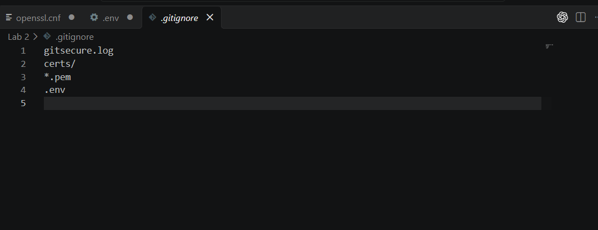

**Nội dung hình.** Tệp `.gitignore` gồm 4 dòng: `gitsecure.log`, `certs/`, `*.pem`, `.env`.

**Mục đích.** Ngăn Git theo dõi và đẩy lên GitHub các tệp nhạy cảm hoặc không nên chia sẻ:

| Mẫu | Lý do loại trừ |
|---|---|
| `.env` | Chứa mật khẩu ứng dụng Gmail (Hình 4). |
| `certs/` và `*.pem` | Chứa khóa riêng và chứng chỉ (từ Lab 1). |
| `gitsecure.log` | Nhật ký của công cụ kiểm tra bí mật (GitSecure) trước khi commit. |

**Nhận xét.** Đây là biện pháp phòng ngừa **rò rỉ bí mật** (secret leakage). Bí mật đã lỡ commit vẫn còn trong lịch sử Git, nên phải khai báo `.gitignore` **trước** khi chạy `git add`.

---

### Hình 7 – Chạy `cli.py` ở chế độ tương tác

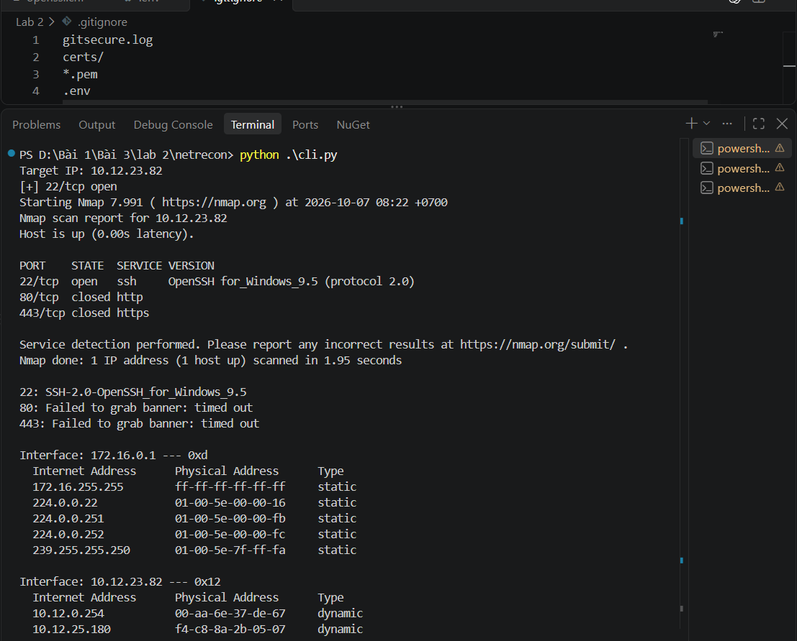

**Nội dung hình.** Lệnh `python .\cli.py` hỏi `Target IP:`, nhập `10.12.23.82` (địa chỉ máy thực hiện). Các tham số còn lại dùng mặc định: cổng `22,80,443`, `--mode all`, `--rate-limit 100`. Kết quả gồm các phần:

1. **Quét cổng:** `[+] 22/tcp open`.
2. **Nhận diện dịch vụ (Nmap):** host up (độ trễ 0.00 s); 22/tcp **open** `ssh` `OpenSSH for_Windows_9.5 (protocol 2.0)`; 80/tcp `closed` `http`; 443/tcp `closed` `https`; quét xong trong 1.95 giây.
3. **Banner Grabbing:** cổng 22 trả `SSH-2.0-OpenSSH_for_Windows_9.5`; cổng 80 và 443 `Failed to grab banner: timed out`.
4. **Bản đồ mạng (ARP):** hai card mạng, `172.16.0.1` (0xd) và `10.12.23.82` (0x12).

**Mục đích.** Chạy đầy đủ các module ở chế độ `all`, đây là kịch bản kiểm thử chính của lab.

**Phân tích:**

- **Hai kỹ thuật cho kết quả thống nhất.** Nmap (`-sV`) và banner grabbing độc lập cùng xác định cổng 22 chạy **OpenSSH for Windows 9.5**. Hai nguồn xác nhận chéo nhau làm kết quả đáng tin hơn.
- **Cổng 80 và 443 đóng.** Máy chưa chạy máy chủ web; banner không lấy được vì không có dịch vụ nào gửi dữ liệu trong 2 giây.
- **Bản đồ mạng.** Hai card mạng có thể là card ảo (dải `172.16.x.x`) và card mạng thật (dải `10.12.x.x`). Mục `dynamic` là máy được học qua ARP (ví dụ `10.12.0.254` nhiều khả năng là cổng mặc định). Mục `static` là địa chỉ đặc biệt: `224.0.0.22` (IGMP), `224.0.0.251` (mDNS), `224.0.0.252` (LLMNR), `239.255.255.250` (SSDP) và địa chỉ quảng bá `ff-ff-ff-ff-ff-ff`.
- **Dòng `[+] 22/tcp open` xuất hiện đầu tiên** vì bộ quét cổng là bước chạy trước và in kết quả ngay khi kết nối thành công.

**Nhận xét.** Công cụ hoạt động đúng thiết kế ở chế độ tương tác. Cổng 22 mở cho thấy dịch vụ OpenSSH Server đang chạy trên máy: đây là **bề mặt tấn công** cần được chủ động quản lý (chỉ bật khi cần, dùng mật khẩu mạnh hoặc khóa công khai).

---

### Hình 8 – Quét `scanme.nmap.org` bằng tham số dòng lệnh

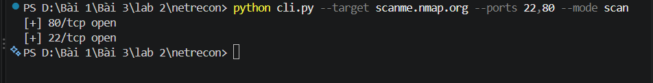

**Nội dung hình.** Lệnh `python cli.py --target scanme.nmap.org --ports 22,80 --mode scan`. Kết quả: `[+] 80/tcp open` và `[+] 22/tcp open`.

**Mục đích.** Kiểm thử công cụ với máy đích bên ngoài **được phép quét** và kiểm tra chế độ `--mode scan` (chỉ quét cổng, không chạy các module khác).

**Phân tích.**
- Công cụ phân giải được **tên miền** (không chỉ IP) và quét song song hai cổng.
- Cổng **80 hiện trước 22** là do bản chất bất đồng bộ: các tác vụ `scan_port` chạy đồng thời và cổng nào hoàn tất kết nối trước sẽ in trước, thứ tự không cố định.
- Kết quả cho thấy `scanme.nmap.org` mở SSH (22) và HTTP (80), phù hợp mục đích của máy thử nghiệm này.

**Nhận xét.** Chế độ `--mode` giúp chọn đúng chức năng cần dùng, giảm lưu lượng và thời gian khi chỉ cần một kỹ thuật.

---

### Hình 9 – Quét địa chỉ `192.168.1.1` ở chế độ `all`

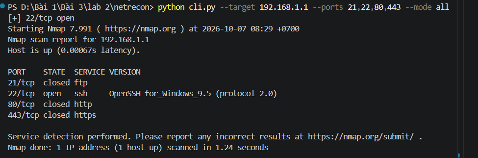

**Nội dung hình.** Lệnh `python cli.py --target 192.168.1.1 --ports 21,22,80,443 --mode all`. Kết quả: `[+] 22/tcp open`; Nmap báo host up (độ trễ 0.00067 s); 21/tcp `closed ftp`, 22/tcp `open ssh OpenSSH for_Windows_9.5 (protocol 2.0)`, 80/tcp `closed http`, 443/tcp `closed https`; quét xong trong 1.24 giây.

**Mục đích.** Kiểm thử trường hợp mục tiêu là một địa chỉ trong dải mạng riêng khác, đồng thời thêm cổng 21 (FTP) vào danh sách quét.

**Phân tích.** Địa chỉ này phản hồi bằng đúng dịch vụ `OpenSSH for_Windows_9.5` và độ trễ dưới 1 ms. Các dấu hiệu đó cho thấy đây rất có thể là **một địa chỉ thuộc chính máy thực hiện** (ví dụ card mạng ảo), chứ không phải một thiết bị khác như bộ định tuyến. Điều này khác với tình huống mẫu trong giáo trình, nơi máy đích không phản hồi.

**Nhận xét.** Kết quả minh họa rằng việc **xác định đúng bản chất mục tiêu** quan trọng không kém việc đọc kết quả quét: cùng một địa chỉ riêng có thể là thiết bị khác nhau tùy mạng. Công cụ vẫn xử lý đúng khi một số cổng mở và số khác đóng.

---

### Hình 10 – Khởi động ứng dụng web `app.py`

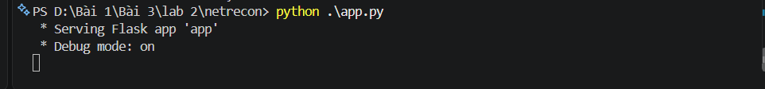

**Nội dung hình.** Terminal chạy `python .\app.py`, hiện `Serving Flask app 'app'` và `Debug mode: on`.

**Mục đích.** Khởi động máy chủ web Flask (cổng 5000) để cung cấp giao diện quét qua trình duyệt.

**Nhận xét.** Ứng dụng khởi động thành công. Về bảo mật, mã `app.run(debug=True, host='0.0.0.0', port=5000)` có hai điểm cần lưu ý trong môi trường thực tế: (1) `debug=True` bật bộ gỡ lỗi Werkzeug, không an toàn ngoài môi trường phát triển; (2) `host='0.0.0.0'` cho phép **mọi máy trong mạng** truy cập công cụ quét. Trong lab, điều này chấp nhận được, nhưng khi triển khai nên dùng `host='127.0.0.1'`, tắt debug và thêm xác thực.

---

### Hình 11 – Giao diện web NetRecon

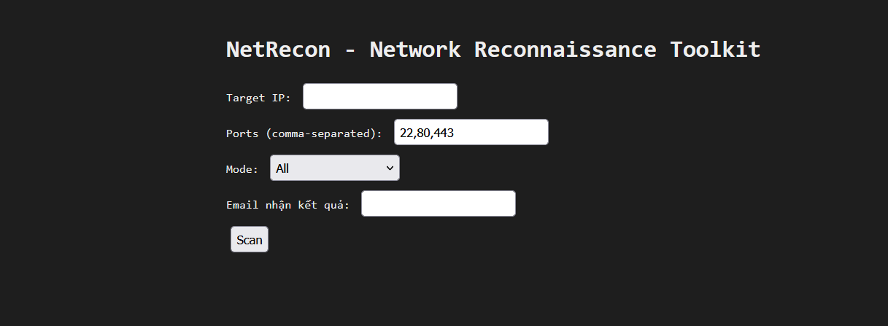

**Nội dung hình.** Trang `NetRecon – Network Reconnaissance Toolkit` nền tối gồm các trường:

| Trường | Ý nghĩa |
|---|---|
| Target IP | Địa chỉ mục tiêu cần quét. |
| Ports (comma-separated) | Danh sách cổng, mặc định `22,80,443`. |
| Mode | Chức năng (`All`, `Port Scan`, `Service Detection`, `Banner Grab`, `Network Map`, `Vulnerability Check`). |
| Email nhận kết quả | Địa chỉ nhận báo cáo. |
| Nút **Scan** | Gửi biểu mẫu `POST /scan`. |

**Mục đích.** Cung cấp giao diện đồ họa thân thiện thay cho dòng lệnh. Giao diện được dựng từ `layout.html` (khung chung), `index.html` (biểu mẫu) và `style.css` (nền `#1e1e1e`, chữ monospace).

**Nhận xét.** Mẫu `index.html` kế thừa `layout.html` qua cơ chế ``/`` của Jinja2, giúp tái sử dụng bố cục. Giao diện đáp ứng đầy đủ các tham số của phiên bản dòng lệnh.

---

### Hình 12 – Kết quả quét hiển thị trên web

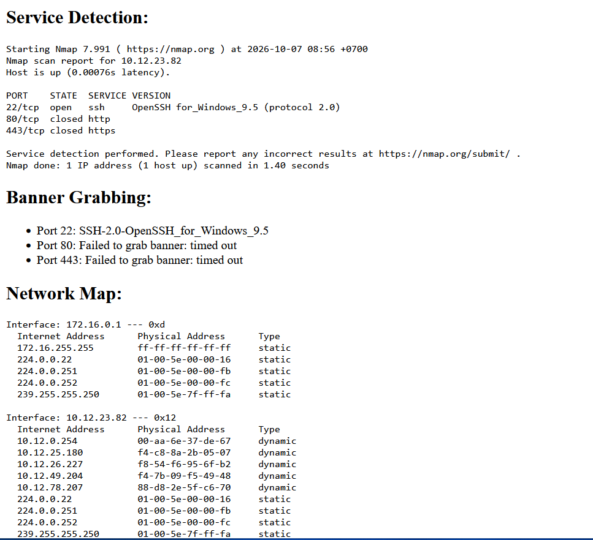

**Nội dung hình.** Trang kết quả (`result.html`) sau khi quét `10.12.23.82` lúc 08:56 gồm các mục:

- **Service Detection:** 22/tcp `open ssh OpenSSH for_Windows_9.5`; 80/tcp, 443/tcp `closed`; quét xong trong 1.40 giây.
- **Banner Grabbing:** cổng 22 `SSH-2.0-OpenSSH_for_Windows_9.5`; cổng 80 và 443 `Failed to grab banner: timed out`.
- **Network Map:** bảng ARP của hai card mạng `172.16.0.1` và `10.12.23.82`.

**Mục đích.** Chứng minh giao diện web gọi đúng các module và hiển thị kết quả có cấu trúc: dữ liệu quét được `app.py` thu vào từ điển `result` rồi truyền cho mẫu `result.html` để vẽ từng mục.

**Phân tích.**
- Kết quả **trùng khớp** với chế độ dòng lệnh (Hình 7), cho thấy hai giao diện dùng chung các module xử lý.
- Mục **Scan Result không xuất hiện**, vì hàm `async_scan_ports` chỉ in `[+] cổng open` ra terminal chứ không trả dữ liệu về, nên `result['scan']` rỗng và mẫu bỏ qua khối này. Kết quả mở cổng nằm ở terminal chạy `app.py`.
- Mục **Vulnerability Check** nằm phía dưới trang (không nằm trong khung ảnh).

**Nhận xét.** Giao diện web hoạt động đúng, kết quả dễ đọc nhờ chia mục theo từng kỹ thuật.

---

### Hình 13 – Email kết quả nhận được

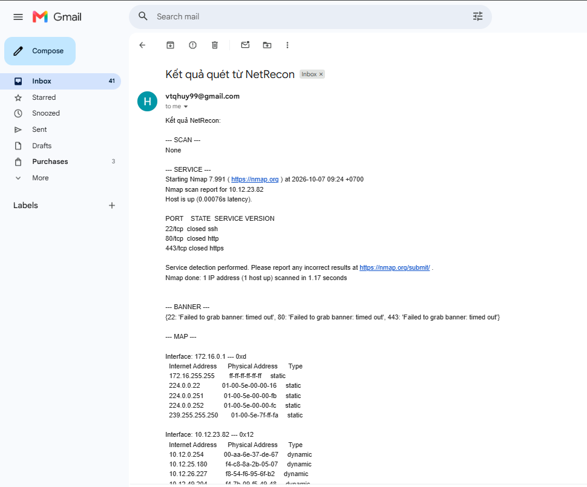

**Nội dung hình.** Hộp thư Gmail có thư **"Kết quả quét từ NetRecon"** gửi từ tài khoản cấu hình trong `.env`, người nhận là chính chủ. Nội dung thư theo từng mục:

- `--- SCAN ---` giá trị `None`.
- `--- SERVICE ---` kết quả Nmap lúc 09:24 cho `10.12.23.82`: 22/tcp `closed ssh`, 80/tcp `closed http`, 443/tcp `closed https`.
- `--- BANNER ---` cả ba cổng `Failed to grab banner: timed out`.
- `--- MAP ---` bảng ARP các card mạng.

**Mục đích.** Chứng minh chức năng **tự động gửi báo cáo** qua SMTP hoạt động: sau khi quét xong, `app.py` ghép kết quả thành nội dung thư (`body`) rồi gọi `email_sender.send_email()`.

**Phân tích:**

- **`SCAN: None`** là hệ quả của thiết kế đã nêu ở Hình 12: hàm quét cổng không trả giá trị, nên `asyncio.run(...)` trả `None` và được ghi vào thư.
- **Cổng 22 trong thư là `closed`, trong khi Hình 12 (08:56) là `open`.** Hai lần quét cách nhau khoảng 30 phút và trạng thái cổng 22 đã đổi, phù hợp với việc dịch vụ OpenSSH Server được dừng giữa hai lần quét. Đây là minh chứng cụ thể cho việc **trạng thái cổng thay đổi theo thời gian** và công cụ phản ánh đúng thực tế.
- **Kênh gửi thư an toàn:** kết nối tới Gmail qua cổng 587, nâng cấp lên mã hóa bằng STARTTLS trước khi đăng nhập bằng mật khẩu ứng dụng, nên thông tin xác thực và nội dung thư không đi dạng rõ.

**Nhận xét.** Quy trình khép kín "quét, tổng hợp, gửi thư" hoạt động đúng. Thư đến hộp thư thành công là minh chứng cuối cùng cho thấy cấu hình SMTP, `.env` và mật khẩu ứng dụng đã chính xác.

---

## 4. Sự cố gặp phải và cách khắc phục

| # | Hiện tượng | Nguyên nhân | Khắc phục |
|---|---|---|---|
| 1 | `Failed to resolve " 10.12.23.82"`, `getaddrinfo failed`, Nmap quét 0 máy | Ô Target IP chứa **dấu cách thừa** ở đầu chuỗi, nên bị coi là tên máy | Nhập lại địa chỉ bằng tay, không dán, không để dấu cách |
| 2 | `[SSL: WRONG_VERSION_NUMBER]` khi gửi thư | Dùng `smtplib.SMTP_SSL` với **cổng 587**. Cổng 587 yêu cầu kết nối thường rồi `STARTTLS`, còn `SMTP_SSL` bắt tay SSL ngay từ đầu | Chuyển sang `smtplib.SMTP` và gọi `ehlo()`, `starttls()`, `ehlo()` trước `login()` |
| 3 | `Connection unexpectedly closed` khi đăng nhập | Tệp `.env` **chưa được lưu**, chương trình đọc giá trị mẫu (`your_email@gmail.com`) và Gmail ngắt kết nối. Kiểm tra bằng thử riêng từng bước (kết nối, `STARTTLS`, đăng nhập) cho thấy mạng và TLS đều bình thường | Lưu `.env` (`Ctrl+S`), điền Gmail và mật khẩu ứng dụng thật, chạy lại `app.py` |

**Bài học:** Khi gặp lỗi mạng khó hiểu, cần **tách từng bước** để xác định chính xác điểm thất bại thay vì suy đoán, và luôn kiểm tra giá trị cấu hình thực tế mà chương trình đang đọc.

## 5. Tổng hợp minh chứng

| Hình | Nội dung | Kết quả đạt được |
|---|---|---|
| 1 | `nmap -v` | Nmap 7.991 cài đặt và gọi được |
| 2 | Mật khẩu ứng dụng Google | Có thông tin xác thực riêng cho SMTP |
| 3 | `requirements.txt` | Khai báo đủ thư viện |
| 4 | `.env` | Tách bí mật khỏi mã nguồn |
| 5 | `pip install` | Cài thư viện thành công |
| 6 | `.gitignore` | Ngăn rò rỉ `.env`, `certs/`, `*.pem` |
| 7 | `cli.py` tương tác | Quét, nhận diện dịch vụ, banner, ARP chạy đúng |
| 8 | Quét `scanme.nmap.org` | Hoạt động với tên miền, chế độ `scan` |
| 9 | Quét `192.168.1.1` | Phân biệt cổng mở và đóng, nhận diện OpenSSH 9.5 |
| 10 | `app.py` | Máy chủ Flask chạy |
| 11 | Giao diện web | Biểu mẫu đầy đủ tham số |
| 12 | Kết quả trên web | Hiển thị đúng từng mục, khớp với CLI |
| 13 | Email nhận được | Gửi báo cáo tự động thành công |

## 6. Đánh giá, hạn chế và hướng cải thiện

| Vấn đề | Phân tích | Hướng cải thiện |
|---|---|---|
| Module kiểm tra lỗ hổng chỉ tra cứu tĩnh | `VULN_PORTS` là từ điển cố định (cổng sang CVE): không kiểm tra cổng có mở không, không xác định phiên bản dịch vụ, nên có thể **báo động giả**. Ví dụ CVE-2018-15473 (liệt kê người dùng) ảnh hưởng OpenSSH phiên bản 7.7 trở về trước, trong khi máy thực tế chạy OpenSSH **9.5**. | Chỉ báo cáo cổng đang mở và đối chiếu **phiên bản** từ `nmap -sV` với CVE; hoặc dùng script `vulners` của Nmap. |
| Quét cổng không trả dữ liệu | `async_scan_ports` chỉ `print`, nên mục `SCAN` trong web và email là `None`. | Cho hàm trả về danh sách cổng mở và đưa vào kết quả. |
| Whitelist/blacklist chưa tích hợp | `filter_utils.py` đã có hàm `filter_targets` nhưng `cli.py` và `app.py` chưa gọi. | Lọc mục tiêu qua `filter_targets` trước khi quét. |
| Quét kết nối đầy đủ, dễ bị phát hiện | TCP connect scan hoàn tất bắt tay nên để lại dấu vết (nhật ký OpenSSH của máy đích ghi nhận các kết nối tới cổng 22 rồi ngắt). Công cụ chưa có kỹ thuật ẩn mình như quét SYN. | Dùng quét SYN (`nmap -sS`) với quyền phù hợp; cân nhắc yêu cầu "ẩn mình" của đề. |
| Sơ đồ mạng thụ động | `arp -a` chỉ thấy máy đã giao tiếp gần đây, không khám phá toàn bộ mạng. | Quét ping/ARP chủ động cả dải mạng (khi được phép). |
| Bảo mật ứng dụng web | `debug=True`, `host='0.0.0.0'`, không xác thực, không kiểm tra đầu vào kỹ cho `target`. | Chạy ở `127.0.0.1`, tắt debug, xác thực người dùng, kiểm tra định dạng IP/cổng. |
| Phụ thuộc hệ điều hành | `arp -a` và định dạng đầu ra phụ thuộc Windows. | Dùng thư viện đa nền tảng. |

## 7. Kết luận

Lab đã xây dựng thành công bộ công cụ **NetRecon** với đầy đủ các chức năng yêu cầu và hai giao diện sử dụng:

1. **Chuẩn bị môi trường** hoàn chỉnh: Nmap, thư viện Python, mật khẩu ứng dụng, cấu hình bí mật tách khỏi mã nguồn và `.gitignore` chống rò rỉ (Hình 1–6).
2. **Giao diện dòng lệnh** thực hiện chính xác quét cổng bất đồng bộ, nhận diện dịch vụ, lấy banner và lập sơ đồ mạng; các kết quả của Nmap và banner grabbing **khớp nhau** (Hình 7–9).
3. **Giao diện web** hiển thị kết quả có cấu trúc, nhất quán với dòng lệnh (Hình 10–12).
4. **Gửi báo cáo tự động** qua email bằng SMTP với STARTTLS thành công (Hình 13).
5. Kết quả thực nghiệm cho thấy cổng 22 của máy đang chạy OpenSSH for Windows 9.5 và đổi trạng thái theo thời gian, đồng thời cho thấy giới hạn của việc **chỉ dựa vào danh sách CVE tĩnh** để đánh giá lỗ hổng.

---

## 8. Cấu trúc thư mục 

```
netrecon/
├── modules/
│   ├── __init__.py
│   ├── banner_grabber.py
│   ├── email_sender.py
│   ├── filter_utils.py
│   ├── network_mapper.py
│   ├── port_scanner.py
│   ├── service_detector.py
│   └── vuln_checker.py
├── static/
│   └── style.css
├── templates/
│   ├── index.html
│   ├── layout.html
│   └── result.html
├── .env                # không commit
├── app.py
├── cli.py
└── requirements.txt

```
