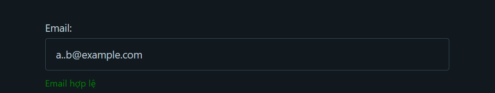
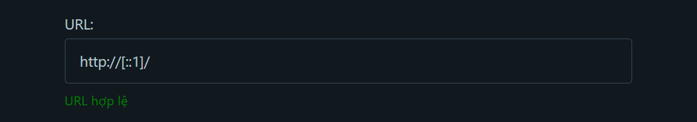
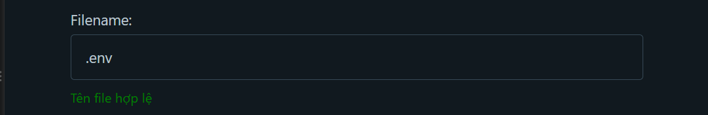

Họ và Tên: Võ Tự Quang Huy
MSSV: 23DATA1
Lớp: 2387700024
LAB1 : SECURE VALIDATOR LAB 
## Phần 1: Cơ chế hoạt động của thư viện `core.py`

Thư viện gồm 5 hàm, chia làm 2 nhóm:

### Nhóm 1 — Validate (kiểm tra định dạng, trả về `True`/`False`)

#### 1.1. `validate_email(email: str) -> bool`

```python
pattern = r'^[\w\.-]+@[\w\.-]+\.\w+$'
return re.fullmatch(pattern, email) is not None
```

**Cơ chế:** dùng regex kiểm tra chuỗi có đúng dạng `local-part@domain.tld` không. `[\w\.-]+` cho phép chữ, số, `_`, `.`, `-` cả trước và sau dấu `@`; `re.fullmatch` yêu cầu toàn bộ chuỗi phải khớp pattern.

**Đã chặn được:** thiếu `@`, nhiều `@`, thiếu domain, thiếu TLD, ký tự khoảng trắng hoặc ký tự đặc biệt như `<`, `>`, dấu ngoặc.

---

#### 1.2. `validate_url(url: str) -> bool`

```python
parsed = urllib.parse.urlparse(url)
return parsed.scheme in ['http', 'https'] and bool(parsed.netloc)
```

**Cơ chế:** dùng `urllib.parse` để tách URL thành scheme và netloc, chỉ chấp nhận `http`/`https` và bắt buộc phải có domain.

**Đã chặn được:** URL dùng giao thức khác như `ftp://`, chuỗi không phải URL hợp lệ (parse lỗi → rơi vào `except` → trả `False`).

---

#### 1.3. `validate_filename(filename: str) -> bool`

```python
if ".." in filename or "/" in filename or "\\" in filename:
    return False
return os.path.basename(filename) == filename
```

**Cơ chế:** kiểm tra chuỗi literal có chứa `".."`, `"/"`, `"\\"` không — dấu hiệu Path Traversal, rồi so sánh với `os.path.basename()`.

**Đã chặn được:** `../../etc/passwd`, đường dẫn tuyệt đối kiểu `/etc/passwd` hoặc `C:\\Users\\x`.

---

### Nhóm 2 — Sanitize (làm sạch dữ liệu, trả về chuỗi đã lọc)

#### 1.4. `sanitize_sql_input(input_str: str) -> str`

```python
sanitized = re.sub(r"(--|;|'|\"|#)", "", input_str)
sanitized = re.sub(r"\b(OR|AND|SELECT|INSERT|DELETE|UPDATE|DROP|UNION|WHERE)\b", "", sanitized, flags=re.IGNORECASE)
return sanitized.strip()
```

**Cơ chế:** blacklist 2 bước — xóa ký tự đặc biệt (`-- ; ' " #`), rồi xóa từ khóa SQL nguy hiểm khi đứng riêng một từ (`\b` word-boundary), không phân biệt hoa/thường.

**Đã chặn được:** payload cổ điển dạng `' OR 1=1 --`.

---

#### 1.5. `sanitize_html_input(html_str: str) -> str`

```python
return html.escape(html_str)
```

**Cơ chế:** dùng `html.escape()` chuẩn của Python, chuyển `< > & " '` thành entity HTML.

**Đã chặn được:** `<script>alert("XSS")</script>` → `&lt;script&gt;alert(&quot;XSS&quot;)&lt;/script&gt;`.

---

## Phần 2: Các lỗ hổng phát hiện được và minh chứng

### 2.1. `validate_email` — chấp nhận dấu chấm sai vị trí (leading/liên tiếp) và ký tự Unicode

- **Hiện trạng ban đầu:** Hệ thống chấp nhận địa chỉ email có dấu chấm đứng ngay trước ký tự `@` hoặc hai dấu chấm liên tiếp (ví dụ: `nhanlam51204.@gmail.com`, `test..a@gmail.com`), thậm chí chấp nhận cả ký tự Unicode trong domain (ví dụ: `test@gmäil.com`).
- **Rủi ro:** Vi phạm tiêu chuẩn cấu trúc RFC 5322 (cấm dấu chấm ở đầu/cuối local-part và cấm 2 dấu chấm liên tiếp); gây lỗi khi hệ thống gửi thư thực tế hoặc làm sai lệch cơ sở dữ liệu người dùng. Với biến thể ký tự Unicode, còn tiềm ẩn nguy cơ **tấn công giả mạo hiển thị (homograph)** vì `\w` trong Python mặc định khớp cả ký tự Unicode, không giới hạn ASCII.
- **Minh chứng ban đầu:**



Hình 1: Email `a..b@example.com` (hai dấu chấm liên tiếp ở local-part) vẫn được hệ thống báo "Email hợp lệ".

- **Giải pháp khắc phục:** Cải tiến biểu thức chính quy để cấm dấu chấm ở đầu/cuối local-part và cấm hai dấu chấm liên tiếp ở cả local-part lẫn domain, đồng thời giới hạn ký tự trong phạm vi ASCII:

```python
pattern = r'^[a-zA-Z0-9_%+-]+(?:\.[a-zA-Z0-9_%+-]+)*@[a-zA-Z0-9-]+(?:\.[a-zA-Z0-9-]+)*\.[a-zA-Z]{2,}$'
return re.fullmatch(pattern, email) is not None
```
Nhóm `(?:\.[a-zA-Z0-9_%+-]+)*` chỉ cho phép dấu chấm đứng **giữa** hai cụm ký tự hợp lệ, loại bỏ hoàn toàn khả năng dấu chấm đứng đầu/cuối hoặc liên tiếp. Về lâu dài nên thay hẳn bằng thư viện đã kiểm chứng theo chuẩn RFC như `email-validator` thay vì tự viết regex.

---

### 2.2. `validate_url` — không chặn SSRF (server-side request forgery)

- **Hiện trạng ban đầu:** Hệ thống chỉ kiểm tra scheme là `http`/`https` và có `netloc`, không kiểm tra netloc trỏ về đâu. Các địa chỉ loopback (`127.0.0.1`, `[::1]`), địa chỉ cloud metadata (`169.254.169.254`), hay URL có cú pháp userinfo gây nhầm lẫn (`http://google.com@127.0.0.1/`) đều được báo là "URL hợp lệ".
- **Rủi ro:** Đây chính là lỗ hổng **SSRF (Server-Side Request Forgery)** mà docstring của hàm khẳng định đã ngăn chặn nhưng thực tế chưa làm được. Nếu URL sau khi "validate" được dùng để server tự gửi request (tải ảnh từ URL, webhook, preview link...), kẻ tấn công có thể dùng chính server nạn nhân để truy cập tài nguyên nội bộ hoặc đánh cắp cloud IAM credentials qua endpoint metadata.
- **Minh chứng ban đầu:**



Hình 2: URL `http://[::1]/` (địa chỉ loopback IPv6) vẫn được hệ thống báo "URL hợp lệ".

- **Giải pháp khắc phục:** Sau khi kiểm tra định dạng, cần resolve hostname ra IP thật và đối chiếu với danh sách IP nội bộ/dành riêng bị chặn:

```python
import socket, ipaddress

BLOCKED_NETWORKS = [
    ipaddress.ip_network("127.0.0.0/8"),
    ipaddress.ip_network("10.0.0.0/8"),
    ipaddress.ip_network("172.16.0.0/12"),
    ipaddress.ip_network("192.168.0.0/16"),
    ipaddress.ip_network("169.254.0.0/16"),   # link-local, chứa cloud metadata endpoint
    ipaddress.ip_network("::1/128"),
    ipaddress.ip_network("fc00::/7"),
]

def validate_url(url: str) -> bool:
    try:
        parsed = urllib.parse.urlparse(url)
        if parsed.scheme not in ("http", "https") or not parsed.hostname:
            return False
        ip = ipaddress.ip_address(socket.gethostbyname(parsed.hostname))
        if any(ip in net for net in BLOCKED_NETWORKS):
            return False
        return True
    except Exception:
        return False
```
Cách này chặn được cả trick userinfo (`user@127.0.0.1`) vì dùng `parsed.hostname` (chỉ lấy phần host thật) thay vì `parsed.netloc` (bao gồm cả userinfo).

---

### 2.3. `validate_filename` — không decode trước khi kiểm tra, bỏ sót dotfile

- **Hiện trạng ban đầu:** Hàm chỉ kiểm tra ký tự literal `".."`, `"/"`, `"\\"` trên chuỗi thô, chưa decode URL-encoding. Chuỗi `%2e%2e%2fetc%2fpasswd` (đã encode toàn bộ) không chứa các ký tự literal này nên vẫn qua được kiểm tra. Ngoài ra tên file bắt đầu bằng dấu chấm như `.env` cũng được chấp nhận là hợp lệ.
- **Rủi ro:** Nếu tầng xử lý phía sau (framework, thư viện lưu file) tự động decode chuỗi thêm một lần nữa trước khi ghi/đọc file, path traversal thực sự vẫn xảy ra dù đã qua "validate". Với trường hợp `.env`, nếu filename được dùng để ghi vào thư mục có sẵn file cấu hình, đây là rủi ro **ghi đè file nhạy cảm**.
- **Minh chứng ban đầu:**



Hình 3: Tên file `.env` vẫn được hệ thống báo "Tên file hợp lệ".

- **Giải pháp khắc phục:** Decode đầy đủ (kể cả nhiều lớp) trước khi kiểm tra, dùng `os.path.realpath()` đối chiếu với thư mục gốc cho phép, và cân nhắc chặn thêm dotfile tùy chính sách:

```python
import urllib.parse, os

def validate_filename(filename: str, allowed_dir: str) -> bool:
    decoded = urllib.parse.unquote(urllib.parse.unquote(filename))  # decode 2 lớp
    if ".." in decoded or "/" in decoded or "\\" in decoded or "\x00" in decoded:
        return False
    if decoded.startswith("."):          # tùy chính sách: có thể chặn hẳn dotfile
        return False
    full_path = os.path.realpath(os.path.join(allowed_dir, decoded))
    return full_path.startswith(os.path.realpath(allowed_dir) + os.sep)
```

---

### 2.4. `sanitize_sql_input` — không xử lý comment `/* */` và thiếu từ khóa trong blacklist

- **Hiện trạng ban đầu:** Hàm chỉ xóa ký tự `-- ; ' " #` và các từ khóa `OR|AND|SELECT|INSERT|DELETE|UPDATE|DROP|UNION|WHERE` khi đứng riêng một từ (`\b...\b`). Payload `SEL/**/ECT * FROM users` đi qua **hoàn toàn không đổi**, vì `/**/` chia từ khóa `SELECT` thành 2 token riêng biệt (`SEL` và `ECT`) nên regex `\bSELECT\b` không nhận diện được. Payload `' XOR SLEEP(5) XOR '` cũng chỉ mất dấu nháy vì `XOR`, `SLEEP` không nằm trong danh sách bị lọc.
- **Rủi ro:** Đây là kỹ thuật **comment-splitting** rất phổ biến trong khai thác SQL injection thực chiến (đặc biệt với MySQL, vốn bỏ qua `/* */` khi thực thi). Kết hợp với các từ khóa không bị lọc (`XOR`, `SLEEP`, `BENCHMARK`...), kẻ tấn công vẫn thực hiện được UNION-based hoặc time-based blind SQL injection dù dữ liệu đã qua "sanitize".
- **Giải pháp khắc phục:** Về nguyên tắc, không có blacklist nào là đủ — giải pháp triệt để là chuyển sang **Parameterized Query / Prepared Statement**:

```python
# Sai (dù đã "sanitize"):
cursor.execute(f"SELECT * FROM users WHERE name = '{sanitize_sql_input(name)}'")

# Đúng — để SQL engine tự tách biệt dữ liệu và câu lệnh:
cursor.execute("SELECT * FROM users WHERE name = %s", (name,))
```
Nếu bắt buộc phải giữ hàm sanitize như một lớp phòng thủ bổ sung, cần vá thêm việc loại bỏ toàn bộ comment trước khi lọc từ khóa:
```python
sanitized = re.sub(r"/\*.*?\*/", "", input_str, flags=re.DOTALL)  # xóa comment /* */ trước
sanitized = re.sub(r"(--|;|'|\"|#)", "", sanitized)
sanitized = re.sub(r"\b(OR|AND|SELECT|INSERT|DELETE|UPDATE|DROP|UNION|WHERE|XOR|SLEEP|BENCHMARK)\b",
                    "", sanitized, flags=re.IGNORECASE)
return sanitized.strip()
```

---

### 2.5. `sanitize_html_input` — chỉ an toàn trong ngữ cảnh HTML body, không an toàn với `javascript:` URI

- **Hiện trạng ban đầu:** `html.escape()` chỉ escape 5 ký tự `< > & " '`. Payload `javascript:alert(document.cookie)` đi qua **không đổi gì** vì dấu `:` `(` `)` không nằm trong danh sách escape.
- **Rủi ro:** Nếu giá trị sau khi "sanitize" được tái sử dụng trong thuộc tính `href`/`src` (ví dụ `<a href="{sanitize_html_input(link)}">`), click vào link sẽ thực thi JavaScript — XSS qua `javascript:` URI vẫn xảy ra dù dữ liệu đã qua sanitize.
- **Giải pháp khắc phục:** Kiểm tra thêm scheme được phép khi giá trị dùng cho `href`/`src`, không chỉ escape ký tự HTML:

```python
ALLOWED_SCHEMES = ("http", "https", "mailto")

def sanitize_url_attribute(value: str) -> str:
    scheme = urllib.parse.urlparse(value).scheme.lower()
    if scheme and scheme not in ALLOWED_SCHEMES:
        return "#"   # hoặc từ chối hẳn giá trị
    return html.escape(value)
```
Về lâu dài, áp dụng **contextual output encoding**: escape khác nhau tùy vị trí dữ liệu được chèn (HTML body, HTML attribute, URL, JavaScript string), thay vì dùng một hàm `html.escape()` chung cho mọi nơi.

---

## Phần 3: Kết luận

Cả 5 lỗ hổng trên đều xuất phát từ cùng một nguyên nhân gốc: **cơ chế blacklist/regex tự viết chỉ chặn được những gì người viết code đã lường trước, không bao giờ đầy đủ 100%.** Hướng khắc phục bền vững không phải vá thêm từng trường hợp lẻ tẻ, mà là dùng đúng công cụ cho đúng bài toán: 

- Tuân thủ nguyên tắc whitelist ưu tiên hơn blacklist: chỉ cho phép các giá trị, ký tự hoặc mẫu dữ liệu được định nghĩa rõ ràng và an toàn, thay vì cố gắng loại bỏ những thứ không mong muốn một cách ngẫu nhiên.
- **Email:** dùng thư viện chuẩn đã kiểm chứng theo RFC (ví dụ `email-validator`) thay vì tự viết regex.
- **SQL Injection:** chuyển sang **Parameterized Query / Prepared Statement**, để SQL engine tự tách biệt dữ liệu và câu lệnh, không cần đoán từ khóa nguy hiểm.
- **Path Traversal:** decode chuỗi đầy đủ **trước** khi kiểm tra, đồng thời dùng `os.path.realpath()` so sánh với thư mục gốc cho phép (allowlist), thay vì chỉ tìm ký tự cấm.
